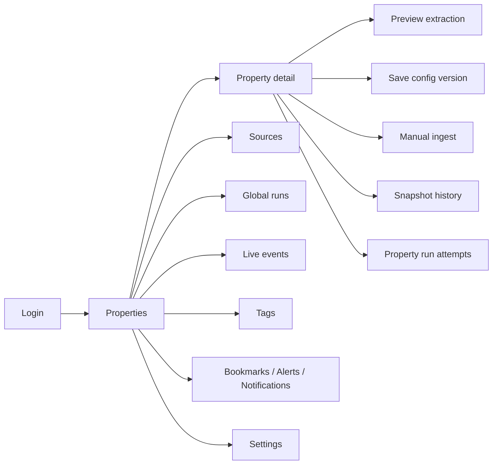

# UI / UX Specification

## Status

This document now tracks the current authenticated property-operations UI. Earlier listing-explorer and market-intelligence concepts are preserved only as historical context and should not drive new implementation while the backend runtime remains centered on tracked properties rather than public catalog routes.

## Product Posture

The app is an operator workspace, not a public browsing experience. The interface should optimize for:

- fast triage across many tracked properties
- clear distinction between preview, saved configuration, and persisted run history
- explicit operational status, errors, and destructive actions
- high information density without sacrificing legibility

## Primary Screen System

### Core route responsibilities

| Route area | UX purpose |
| --- | --- |
| `LoginPage` | Re-establish access with minimal friction and clear redirect recovery |
| `PropertiesPage` | Primary control room for tracked entities, status scanning, and frequent actions |
| `PropertyDetailPage` | Deep work surface for extraction logic, manual runs, snapshots, and troubleshooting |
| `SourcesPage` | Manage reusable source records and source-linked workflows |
| `RunsPage` | Inspect stored snapshots across properties |
| `EventsPage` | Monitor live operational events within the current browser session |
| `TagsPage` | Maintain categorization primitives used by property filtering |
| `BookmarksPage`, `AlertsPage`, `NotificationsPage` | User-centric tracking workflows layered on top of operations data |
| `SettingsPage` | Profile and password maintenance |

## Design Principles

### 1. Operational clarity first

Every page should make these things obvious:

- what is merely previewed
- what is saved and versioned
- what creates durable history
- what can fail and how the user notices it

### 2. Dense, consistent panels

The shared panel and table system should remain compact and repeatable across routes. `PageCard`, `DataTable`, banners, dialogs, and badges should keep layout behavior predictable.

### 3. Status is part of navigation

Operators should be able to understand health from the list view before opening detail pages. Status badges, last-run timestamps, next-run timestamps, and error copy are navigational aids, not secondary decoration.

### 4. Persistence boundaries must be visible

The UI needs to distinguish:

- local draft state
- stateless extraction preview
- saved extraction config versions
- persisted snapshots
- scheduler attempt history

Confusing any of those will create maintenance bugs and poor operator trust.

## Shared UI Rules

### Shell

- The authenticated shell keeps navigation, page title framing, and route outlet stable.
- Mobile behavior collapses the nav automatically when the route changes under smaller viewports.
- The skip link and keyboard-focusable main content target are required parts of the shell.

### Tables

- Table rows should expose the highest-signal identity and status information first.
- Row actions belong at the right edge and should stay short and explicit.
- Empty states should explain the absence of data, not merely repeat the route title.

### Status and feedback

- `StatusBadge` should represent operational truth, not stylistic variation.
- `ErrorBanner` is for blocking or workflow-critical problems.
- Toasts confirm short-lived mutation outcomes and should not replace durable status indicators.

### Dialogs

- Destructive actions must use confirmation dialogs.
- Detail dialogs should help inspection, not replace a primary route when the object has lasting operational importance.

## Route-Level UX Expectations

### Properties list

The properties page is the main operational dashboard.

It should support:

- fast scanning by label or URL
- tag-based filtering
- bookmark-only filtering
- direct access to create, ingest, inspect, and delete actions
- clear visibility into tracking cadence and latest extraction health

Filtering that matters across refreshes should stay in the URL.

### Property detail

This page is where the system becomes explainable.

It should make these workflows legible:

1. define or revise selectors
2. preview selectors without persisting data
3. save a new config version intentionally
4. trigger a manual ingest
5. inspect resulting snapshots and field changes
6. inspect scheduler attempt history separately from snapshots

The preview path must feel exploratory. Saving config and manual ingest must feel deliberate.

### Sources

Sources should be presented as reusable metadata and selector-assist records, not as the primary object the operator lives in all day.

### Global runs

The runs route is a cross-property snapshot browser. It should always be described in that language. It is not a queue view and not the same thing as property-run attempts.

### Live events

The events route is an in-session diagnostic tool.

- connection state must be visible
- the current-session nature of the buffer must be explicit
- the payload inspection flow should favor debugging speed over presentation polish

## State And Interaction Rules

### URL-backed state

Use the URL for filters that should survive refresh or deep linking.

Current examples:

- repeated `tag` params
- `match` mode for tag filtering
- run filters on the global runs page

### Client stores

Use Zustand only for shared client concerns:

- session token and expiry
- shell navigation state
- in-memory live event buffer

### Server state

Use TanStack Query for all backend data reads and writes. UI features should not manually mirror server collections in local stores.

## Visual Direction

The existing design system already provides the right direction:

- dark, calm shell chrome
- compact but readable tables and forms
- restrained use of accent color for actions and focus
- strong distinction between neutral, warning, success, and danger states

Typography and spacing should continue to emphasize scanability over spaciousness.

## Legacy Planning Note

The earlier versions of this file described a public listing explorer, map/session viewport behavior, compare baskets, price-history modal workflows, and geospatial readiness. Treat those sections as product-history notes only.

If public catalog work returns, restart from the current mounted backend/runtime documentation first and then define a fresh UI spec instead of reviving those assumptions verbatim.
