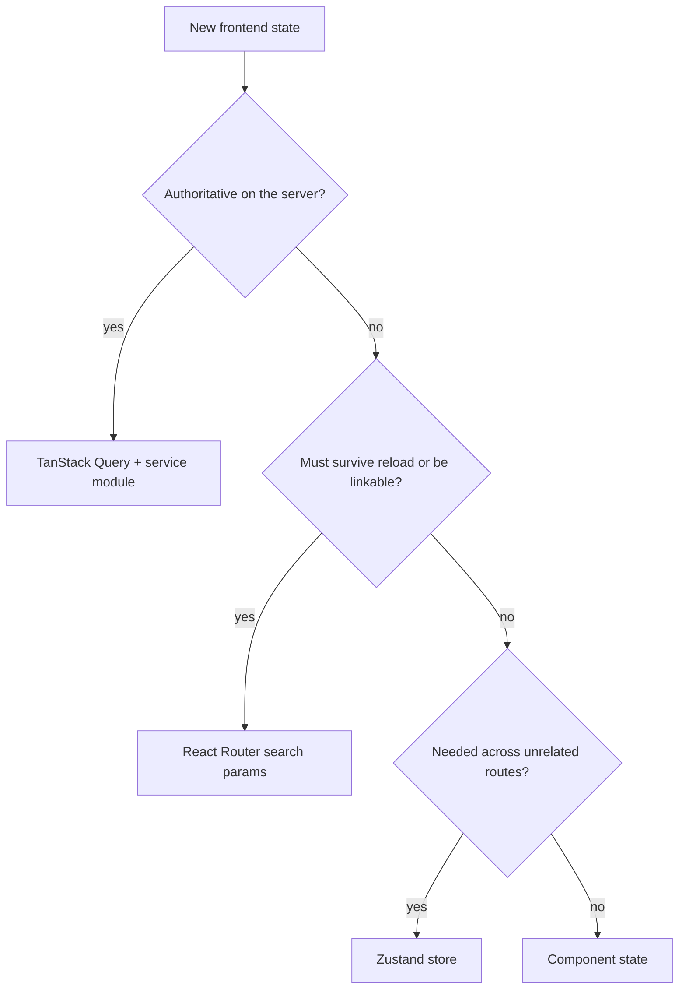
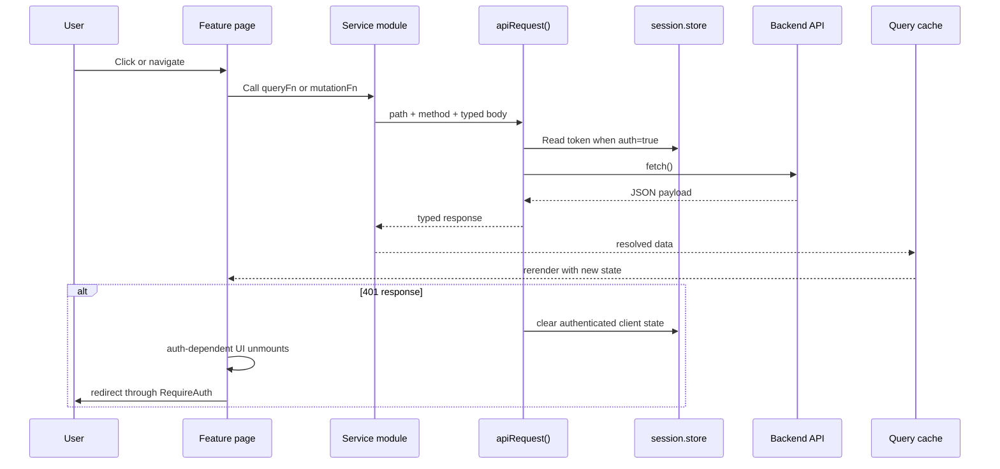
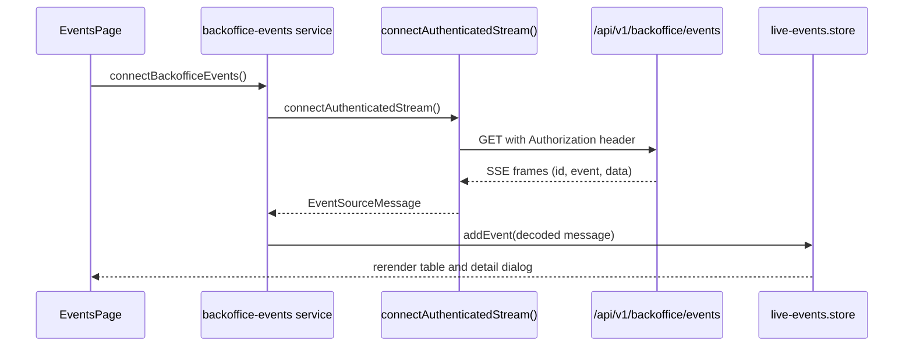

# Frontend Architecture

## Purpose

The frontend under `/app` is an authenticated React operations console for tracked property monitoring and maintenance. It is optimized for backoffice workflows rather than public browsing. The browser owns presentation, local interaction state, and session persistence. The backend remains the source of truth for properties, extraction configs, snapshots, scheduler history, tags, alerts, notifications, and live events.

Use this document for the mounted runtime and ownership boundaries. Use [design-patterns.md](./design-patterns.md) for the implementation rules that should remain stable, [local-development.md](./local-development.md) for startup, [backend-contract.md](./backend-contract.md) for wire details, and [maintenance.md](./maintenance.md) for day-2 changes.

## Use This When

Read this when you need to answer any of these questions before editing code:

- which routes and workflows are actually mounted today
- where auth, shell, service, and state boundaries are enforced
- how request, mutation, and live-event flows move through the app
- which feature boundaries should stay intact during refactors

## System Model

```mermaid
flowchart LR
	Browser[Browser] --> Main[src/main.tsx]
	Main --> ThemeInit[applyThemePreference]
	Main --> Providers[AppProviders]
	Providers --> Query[TanStack Query client]
	Providers --> ThemeProvider[ThemeProvider]
	Providers --> ToastProvider[ToastProvider]
	Providers --> Router[React Router]
	Router --> Login[/login]
	Router --> Shell[AppShell]
	Shell --> Guard[RequireAuth]
	Guard --> Pages[Feature pages]
	Pages --> Services[src/services/*]
	Services --> Api[lib/api/client.ts]
	Api --> Backend[/api/v1/*]
	Pages --> Events[EventsPage]
	Events --> SSE[lib/api/sse.ts]
	SSE --> Stream[GET /api/v1/backoffice/events]
```

### Composition rules

- `src/main.tsx` applies the persisted theme preference before React renders so the shell does not flash the wrong theme.
- `src/app/AppProviders.tsx` creates exactly one `QueryClient` at module scope and composes `ThemeProvider`, `ToastProvider`, and `RouterProvider`.
- `src/app/router.tsx` uses element routes only. There are no route loaders or actions in the current app; pages fetch with TanStack Query inside components.
- `src/app/AppShell.tsx` owns the shared authenticated layout, responsive navigation behavior, skip link, and page outlet.
- `src/app/RequireAuth.tsx` reads the persisted session snapshot, redirects to `/login` when expired or missing, and clears protected client state on auth loss.
- `src/app/AppRouteError.tsx` provides route-level recovery instead of allowing shell-level white screens.

## Route Map

The router is intentionally flat and feature-owned. The index route redirects to `/properties`.

| Path | Owner | Responsibility |
| --- | --- | --- |
| `/login` | `features/auth` | Login flow and redirect handoff |
| `/dashboard` | `features/operators` | Operator overview with cross-capability summaries |
| `/triage` | `features/operators` | Review queue for notifications, runs, and follow-up actions |
| `/properties` | `features/properties` | Tracked property list, URL-driven filters, bookmark and ingest actions |
| `/properties/new` | `features/properties` | Property creation |
| `/properties/:propertyId` | `features/properties` | Property detail, extraction config, snapshots, and property-run history |
| `/properties/:propertyId/fields/:fieldName/analysis` | `features/properties` | Field-level analysis for selector tuning |
| `/analytics` | `features/analytics` | Aggregated market-analysis views backed by field and analytics data |
| `/fields` | `features/fields` | Field definition management and unmapped-field review |
| `/sources`, `/sources/new`, `/sources/:sourceId` | `features/backoffice` | Source CRUD, selector preview support, and source-to-property coordination |
| `/runs`, `/runs/:runId` | `features/backoffice` | Global snapshot history and snapshot inspection |
| `/events` | `features/backoffice` | In-session live SSE event feed |
| `/bookmarks`, `/alerts`, `/notifications` | `features/engagement` | User-specific tracking workflows |
| `/tags` | `features/tags` | Tag CRUD and categorization |
| `/settings` | `features/settings` | Account profile, password, and notification preference maintenance |
| `/admin` | `features/platform` | Platform-level settings, integrations, and administrative coordination |

### Shell navigation groups

`components/shell/navigation.ts` groups the mounted routes into four operator-facing sections:

- Core workflow: properties, analytics, bookmarks, alerts
- Operations: dashboard, triage, notifications
- Admin / Advanced: admin, sources, runs, events, fields, tags
- Account: settings

If a route is added or moved, update both the router and the navigation metadata in the same change.

## Ownership Boundaries

| Area | Responsibility | Notes |
| --- | --- | --- |
| `src/app` | Runtime composition | Providers, router, auth guard, shell, route error boundary |
| `src/features` | Route-level workflows | Pages assemble queries, mutations, forms, and feature-specific UI |
| `src/services` | Typed backend contract by capability | DTOs, query key factories, and request functions stay close together |
| `src/lib` | Shared technical primitives | API client, SSE transport, auth helpers, formatters, search-param helpers |
| `src/stores` | Cross-route client state only | Session, shell layout, and live event buffer |
| `src/components` | Reusable presentational building blocks | Shell chrome, tables, dialogs, form controls, tags, selectors |
| `src/styles` | Global tokens and base styles | CSS variables, typography, layout, and component primitives |
| `src/test` | Shared test setup | Test environment wiring for Vitest and Testing Library |

### Service modules currently in use

- `analytics`
- `alert-rules`
- `auth`
- `backoffice-events`
- `backoffice-runs`
- `backoffice-sources`
- `bookmarks`
- `fields`
- `notifications`
- `platform`
- `properties`
- `tags`

Each service module preserves backend JSON vocabulary instead of inventing a separate client-side schema. That keeps contract drift obvious and reduces mapping code.

## State Ownership



### Current ownership model

- TanStack Query owns remote reads, mutations, retries, refetching, and cache invalidation.
- URL search params own shareable filters. `PropertiesPage` already uses this for repeated `tag` params and the `match` strategy.
- Zustand owns only cross-route client concerns: persisted bearer session, shell navigation state, and the in-memory live event stream.
- Component state owns dialogs, drafts, row selection, and temporary view controls.
- Theme preference is persisted separately from business state and applied before boot.

This separation is deliberate. Do not move server state into Zustand unless the data is truly client-authored and not canonical on the backend.

## Request And Mutation Flow



### Transport conventions

- `lib/api/client.ts` is the only place that should attach bearer headers, parse error payloads, or resolve `VITE_API_ORIGIN`.
- Service modules should return domain-shaped values, not raw `Response` objects.
- The app relies on three common backend envelope styles:
  - list responses: `{ items, count }`
  - single-item responses: `{ item }`
  - status responses: `{ status }`
- Login is the main exception: it returns `{ token, user, expires_at }` directly.

## Live Event Flow



Why this matters:

- Native `EventSource` cannot send bearer headers, so the app uses `@microsoft/fetch-event-source`.
- The stream is session-scoped and stored in memory only. Refreshing the page clears the buffer.
- `BackofficeEvent.type` is intentionally typed as `known union | string` because the server emits a broader set of event names than the UI currently enumerates.

## Design Patterns To Preserve

- Keep runtime composition inside `src/main.tsx` and `src/app/*` so mounted behavior stays easy to reason about.
- Keep feature pages responsible for workflow composition and service modules responsible for backend contract handling.
- Keep TanStack Query, URL state, Zustand, and component state responsibilities explicit instead of blending them together.
- Keep shared primitives in `src/components/ui` ahead of route-local markup and styling.
- Keep auth expiry handling, API transport, and SSE transport centralized so protected behavior changes in one place.

For the longer rationale and anti-patterns, continue in [design-patterns.md](./design-patterns.md).

## Feature Boundaries Worth Preserving

### Properties

`features/properties` is the operational center of the app. It owns property CRUD, extraction config editing, stateless preview, manual ingest, snapshots, and property-run inspection. It also coordinates with bookmarks, tags, runs, and notifications.

### Backoffice

`features/backoffice` owns cross-property operational views:

- source CRUD
- global snapshot history under `/runs`
- live event monitoring under `/events`

One important detail: the global `/runs` pages work with stored property snapshots, while property detail pages use `/properties/:propertyId/runs` to show scheduler attempt history.

### Operators

`features/operators` owns summary and queue-oriented workflows that cut across properties, runs, notifications, sources, and tags.

- `DashboardPage` is the operator overview surface.
- `TriageInboxPage` is the review queue.
- `CommandPalette` exposes quick actions and is part of that same workflow cluster.

### Analytics

`features/analytics` owns aggregated views and chart logic. Keep chart-specific transformation helpers close to this feature unless another route genuinely reuses them.

### Fields

`features/fields` owns field definition management. Use it for schema-level field operations; use `features/properties` only when the workflow is about a specific property's extraction behavior.

### Platform

`features/platform` owns administrative and integration-oriented workflows that span alerting, source setup, notifications, platform settings, and summary views. Keep platform-wide coordination here rather than leaking it into operator or property features.

### Engagement

`features/engagement` is user-centric rather than operational. Bookmarks, alerts, and notifications use the same auth/session infrastructure, but they should not absorb property-admin concerns.

### Tags And Selectors

- `features/tags` and `services/tags` own tag CRUD and property-tag assignment.
- `features/selectors` and `components/selectors` should stay focused on selector-building UX, not transport code.

## Testing And Change Hotspots

- Query invalidation is the most common maintenance risk. Keep invalidation keys narrow and capability-specific.
- `PropertiesPage` performs secondary tag queries per row. Be careful when expanding that page because it can increase query fanout quickly.
- Auth expiry behavior crosses page boundaries. Any change to session storage or 401 handling should be tested through `RequireAuth` as well as the touched service.
- Live events are append-only in-memory state. If you need persistence, design that intentionally instead of quietly extending the store.

For change procedures, debugging notes, and a frontend checklist, continue in [maintenance.md](./maintenance.md).