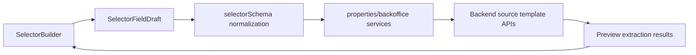

# Selectors Feature

Selectors define how source templates locate and extract property fields from external pages. The active normalization logic lives in `app/src/features/selectors/selectorSchema.ts`, while reusable selector editing UI lives in `app/src/components/selectors/SelectorBuilder.tsx`.

## Data flow

## Contracts

| Contract | File | Purpose |
| --- | --- | --- |
| Draft shape | `app/src/features/selectors/selectorSchema.ts` | Stores UI-editable selector fields before persistence. |
| Legacy normalization | `app/src/features/selectors/selectorSchema.ts` | Converts older backend payloads into current selector contracts. |
| Builder UI | `app/src/components/selectors/SelectorBuilder.tsx` | Renders selector fields, fallback selectors, extraction modes, and validation states. |

## Related

- [Frontend Architecture](../../../docs/frontend/architecture-overview.md)
- [Codebase Navigation](../../../docs/frontend/codebase-navigation.md)
- [Components](../components.md)
