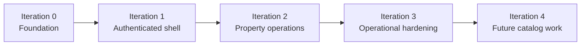

# Frontend Iterations

## Status Note

This roadmap reflects the current mounted application rather than the earlier listing-explorer concept. The frontend is now primarily an authenticated property-operations workspace.

## Iteration 0: Runtime Foundation

Status: implemented

- Establish Vite, React, TypeScript, Vitest, and ESLint foundations.
- Create the provider tree, route shell, design tokens, and test setup.
- Define the typed service-layer pattern and API client conventions.
- Document architecture, local development, and backend contract boundaries.

## Iteration 1: Authenticated Operations Shell

Status: implemented

- Login flow and redirect preservation
- Shared shell with app navigation and route-level error handling
- Persisted session handling and auth guard behavior
- Core route scaffolding for properties, sources, runs, events, tags, engagement, and settings

This is the iteration that turned the app into a coherent internal tool rather than a collection of disconnected screens.

## Iteration 2: Tracked Property Workflows

Status: implemented and under hardening

- Property creation, editing, deletion, and status display
- Extraction config authoring and version save flow
- Stateless preview workflow
- Manual ingest trigger and snapshot inspection
- Property-run history and global run history
- Tag assignment and tag-based property filtering
- Bookmarks, alerts, and notifications tied to tracked properties

This is the current center of gravity for the frontend.

## Iteration 3: Operational Hardening

Status: active hardening path

- Clarify UX copy around preview, save, snapshot, and run distinctions
- Reduce query fanout on property-heavy screens where needed
- Improve diagnostics around scheduler failures and live events
- Expand focused test coverage for auth loss, query invalidation, and destructive flows
- Keep documentation aligned with mounted backend behavior

This work should favor maintenance quality and operational clarity over broad new feature surface.

## Iteration 4: Future Expansion

Planned later

- Denormalized summaries or aggregate endpoints to reduce multi-query list rendering
- Richer event handling or filtering once backend event semantics stabilize
- Any return of public catalog, listings, map, or market-intelligence views

If catalog-style browsing returns, it should be treated as a new product slice with a fresh contract review. The earlier listing-view roadmap should not be assumed to still apply.