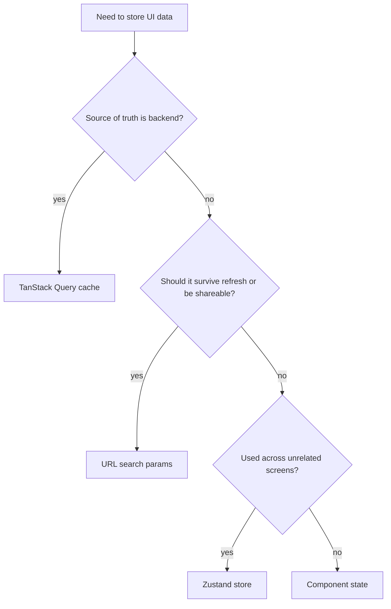

# Frontend Maintenance Guide

## Start Here

Read these in order when you are new to the app:

1. [codebase-map.md](./codebase-map.md)
2. [architecture.md](./architecture.md)
3. [design-system.md](./design-system.md)
4. [backend-contract.md](./backend-contract.md)
5. [local-development.md](./local-development.md)

The app is small enough that correctness comes from preserving boundaries, not from adding more abstraction.

## Find The Right Place Fast

| Change type | Primary entry point | Usually changes nearby |
| --- | --- | --- |
| New page or route | `src/app/router.tsx` | `src/features/<capability>`, `src/components/shell/navigation.ts`, docs in this folder |
| Backend data contract | `src/services/<capability>` | [backend-contract.md](./backend-contract.md), owning feature, focused tests |
| Shared visual pattern | `src/components/ui` | [design-system.md](./design-system.md), `src/styles/globals.css`, affected feature pages |
| Shell framing or navigation | `src/app/AppShell.tsx` | `src/components/shell/*`, `src/stores/shell.store.ts` |
| Auth flow or session expiry | `src/app/RequireAuth.tsx` | `src/stores/session.store.ts`, `src/services/auth`, `src/lib/api/client.ts` |
| Live event behavior | `src/features/backoffice/EventsPage.tsx` | `src/services/backoffice-events`, `src/lib/api/sse.ts`, `src/stores/live-events.store.ts` |
| Theme or tokens | `src/styles/tokens.css` | `src/styles/globals.css`, `src/hooks/useTheme.tsx`, `src/components/shell/ThemeToggle.tsx` |

## Daily Commands

From `/app`:

```bash
pnpm install
pnpm dev
pnpm typecheck
pnpm test
pnpm lint
pnpm build
```

Prefer `pnpm typecheck` and targeted tests before broad UI rewrites.

If a change is docs-only, review the changed markdown for link drift and route drift before moving on.

## Change Routing And Screens

When adding a page or route:

1. Create or extend the page under `src/features/<capability>`.
2. Add the route in `src/app/router.tsx`.
3. If the page belongs in the authenticated shell, update `src/components/shell/navigation.ts` and route metadata together.
4. Keep public routes rare. Most pages should remain behind `RequireAuth`.
5. Add a focused test if the route has auth or redirect behavior.
6. Update [codebase-map.md](./codebase-map.md) and [architecture.md](./architecture.md) when route ownership changes.

Do not put fetch logic in router definitions. The current architecture expects pages to own their TanStack Query hooks directly.

## Change Data Fetching Deliberately

When adding or changing backend data access:

1. Add or update types in `src/services/<capability>/*.types.ts`.
2. Add request functions in the matching `*.service.ts` file.
3. Add or update query key factories in the matching `*.keys.ts` file.
4. Use the service from the page or feature component.
5. Invalidate the narrowest affected keys after a mutation.
6. Update [backend-contract.md](./backend-contract.md) if the API surface changed.

Keep raw `fetch()` usage inside `lib/api/client.ts` and `lib/api/sse.ts`. Service modules should not duplicate header, base URL, or error parsing logic.

## Choose State Intentionally



Current expectations:

- Query cache for remote collections, details, and mutations
- URL params for filters like property tags and match mode
- Zustand for session, shell state, and live events only
- Local state for dialogs, drafts, and table interactions

If you feel tempted to add a new store, write down why component state, URL state, and query cache were not enough.

## Accessibility And UI Discipline

- Keep helper copy outside form labels and connect it with `aria-describedby` so accessible names stay stable for users and tests.
- Reuse shared primitives from `src/components/ui` unless a workflow truly needs a new pattern.
- Keep operational copy explicit. Pages should describe what is persisted, what is preview-only, and what is deleted permanently.
- Preserve the current information-dense layout style. Do not introduce decorative UI that obscures tables, statuses, or timelines.

## Debugging Checklist

### Redirect loops or instant logout

- Check whether the session token exists in `session.store`.
- Check whether `expires_at` has already passed.
- Check the backend response for `401`; `apiRequest()` clears client auth state automatically.

### Mutations succeed but the UI looks stale

- Confirm that the touched feature invalidates the correct query keys.
- Remember that `/runs` and `/properties/:id/runs` are different data sets.
- If a list depends on secondary queries, verify both the primary and secondary keys.

### Live events page does not update

- Check that a token is present.
- Check whether `/api/v1/backoffice/events` returns `401`.
- Check the server middleware stack. SSE requires the backend response writer to preserve `http.Flusher`.

### Properties page feels slow

- It issues one tag query per loaded property row.
- Before adding more per-row queries, consider whether the backend should return denormalized summaries instead.

## High-Risk Areas

- Auth/session flow because it affects every protected route.
- Query invalidation because pages compose properties, runs, bookmarks, tags, and notifications together.
- Extraction config editing because backend DTOs are intentionally explicit and strongly typed.
- Event decoding because the server event set is broader than the frontend’s named union.

## Testing Guidance

- Use page-level tests when behavior spans routing, providers, or auth boundaries.
- Use small component tests for table actions, form validation, and dialog behavior.
- If you change auth handling, run the existing `RequireAuth` coverage and the affected page tests together.
- If you change a service DTO, update both the consuming page and any tests that assert the wire shape.

When the backend contract changes, do not stop at the TypeScript update. Update the doc, the feature code, and the test that proves the UI still handles the response correctly.