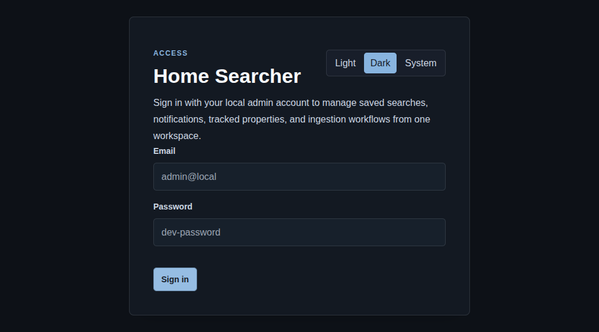

# Sign In

## Screenshot

## What You Do Here
Authenticate into the workspace, confirm the theme you want to use, and return to the protected route you were trying to open.

## Quick Start
1. Open the login route.
2. Choose `Light`, `Dark`, or `System` before signing in if you want a different theme.
3. Enter the local admin email and password.
4. Select `Sign in`.
5. Continue into the workspace shell.

## What To Check
- Theme selection is available before authentication.
- Protected routes redirect here and then return to the original target after a successful sign-in.
- The login page stays focused on access only; everything else happens inside the shell.

## Navigation
- Previous: [Documentation index](../index.md)
- Next: [Shell Navigation](./02-shell-navigation.md)
