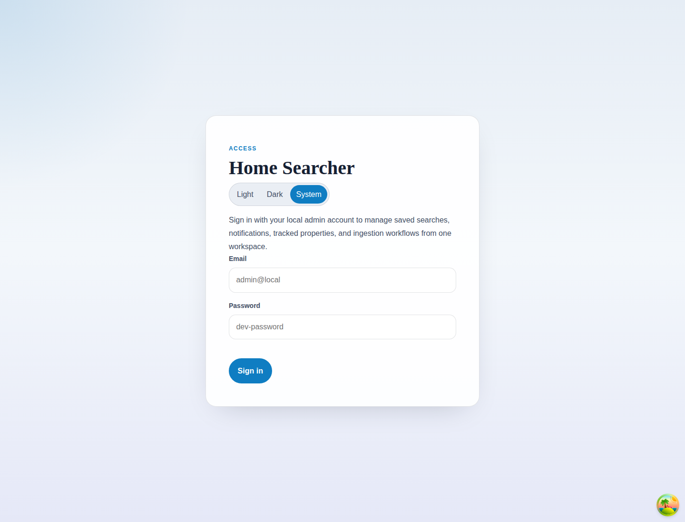

# Login

## Purpose
Authenticate into the workspace to unlock personal tracking and backoffice routes.

## Screenshot

## UI Elements
### Element: Theme toggle
- Type: selector
- Description: Switches between light, dark, and system themes.
- Behavior: Updates the application theme before sign-in.

### Element: Email
- Type: input
- Description: Accepts the account email.
- Behavior: Required for sign-in submission.

### Element: Password
- Type: input
- Description: Accepts the account password.
- Behavior: Required for sign-in submission.

### Element: Sign in
- Type: button
- Description: Sends the credentials to the auth endpoint.
- Behavior: Shows a pending label while authenticating, then routes to the requested page or `/listings`.

## User Actions
- Enter valid credentials → Session is stored and the shell loads.
- Enter invalid credentials → An error banner is shown.
- Open the page with an active session → The app redirects away from login.

## Navigation
- Previous: [Documentation index](../index.md)
- Next: [Shell Navigation](./02-shell-navigation.md)
