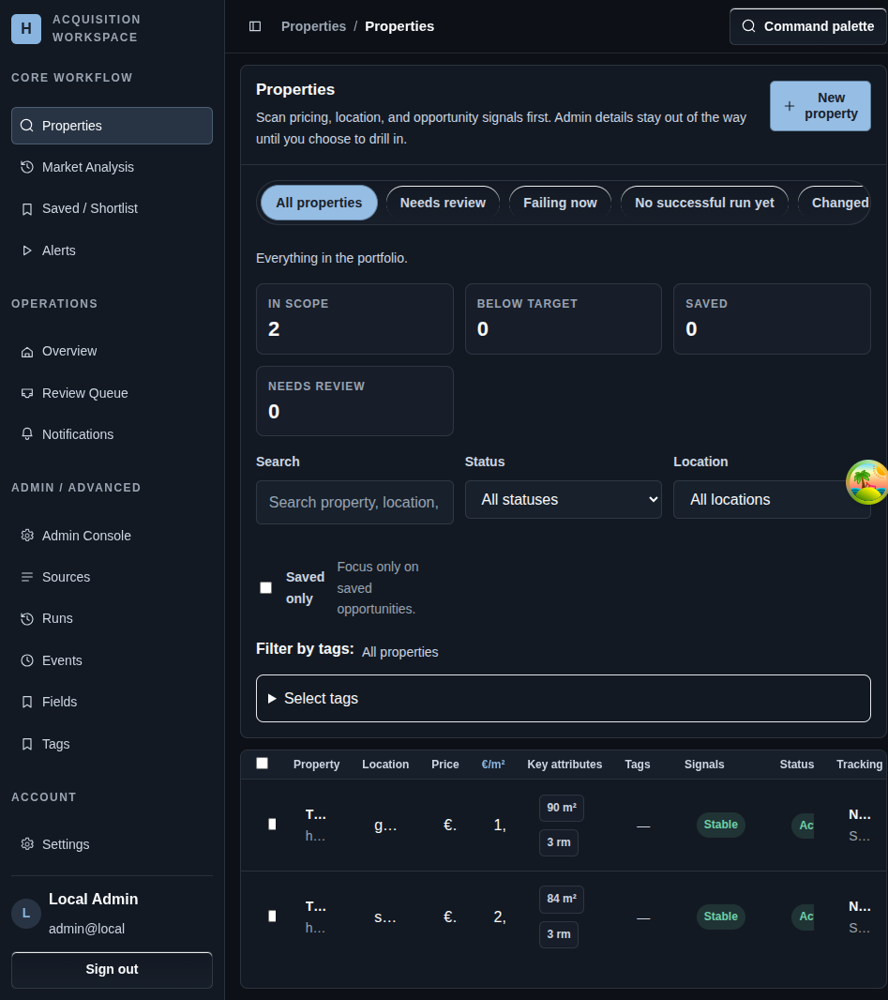

# Shell Navigation

## Screenshot

## What You Do Here
Use the shell to move between the core property workflow, the daily operations views, the advanced admin tools, and your account settings without losing the current authenticated session.

## Quick Start
1. Use the left sidebar to choose a route group: `Core workflow`, `Operations`, `Admin / Advanced`, or `Account`.
2. Use the header to confirm the current section and page title.
3. Open the command palette from the header when you want faster route access.
4. Use the sidebar toggle on narrower layouts.
5. Sign out from the footer when you are done.

## What To Check
- The active route stays inside the shared shell rather than opening a separate layout.
- `Skip to main content` is available for keyboard navigation.
- The footer shows the signed-in user when authentication is present and a sign-in prompt when it is not.
- The shell groups routes by operator job, not by backend endpoint names.

## Navigation
- Previous: [Sign In](./01-login.md)
- Next: [Getting Started](./03-listings.md)
