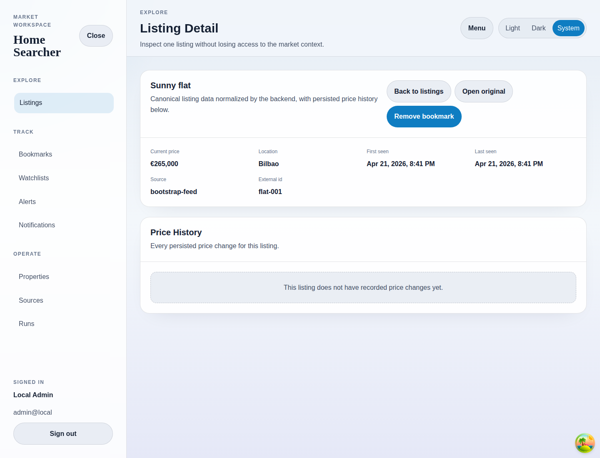

# Listing Detail

## Purpose
Show one normalized listing record and its persisted price-history timeline.

## Screenshot

## UI Elements
### Element: Detail metrics grid
- Type: data panel
- Description: Shows current price, location, first seen, last seen, source, and external id.
- Behavior: Renders the latest canonical backend snapshot.

### Element: Back to listings
- Type: link
- Description: Returns to the explorer.
- Behavior: Navigates back to `/listings`.

### Element: Open original
- Type: link
- Description: Opens the source page outside the app.
- Behavior: Uses the listing URL from the backend.

### Element: Bookmark toggle
- Type: button
- Description: Adds or removes the listing from personal bookmarks.
- Behavior: Requires authentication and shows a pending label while saving.

### Element: Price History panel
- Type: timeline panel
- Description: Lists all persisted price changes for the listing.
- Behavior: Shows an empty-state message when no changes have been recorded.

## User Actions
- Open a listing from the explorer → The detail view loads route-specific data.
- Remove bookmark → The listing is removed from `/bookmarks`.
- Review price history → Operators can see whether prior ingest runs captured price changes.

## Navigation
- Previous: [Listings Explorer](./03-listings.md)
- Next: [Bookmarks](./05-bookmarks.md)
