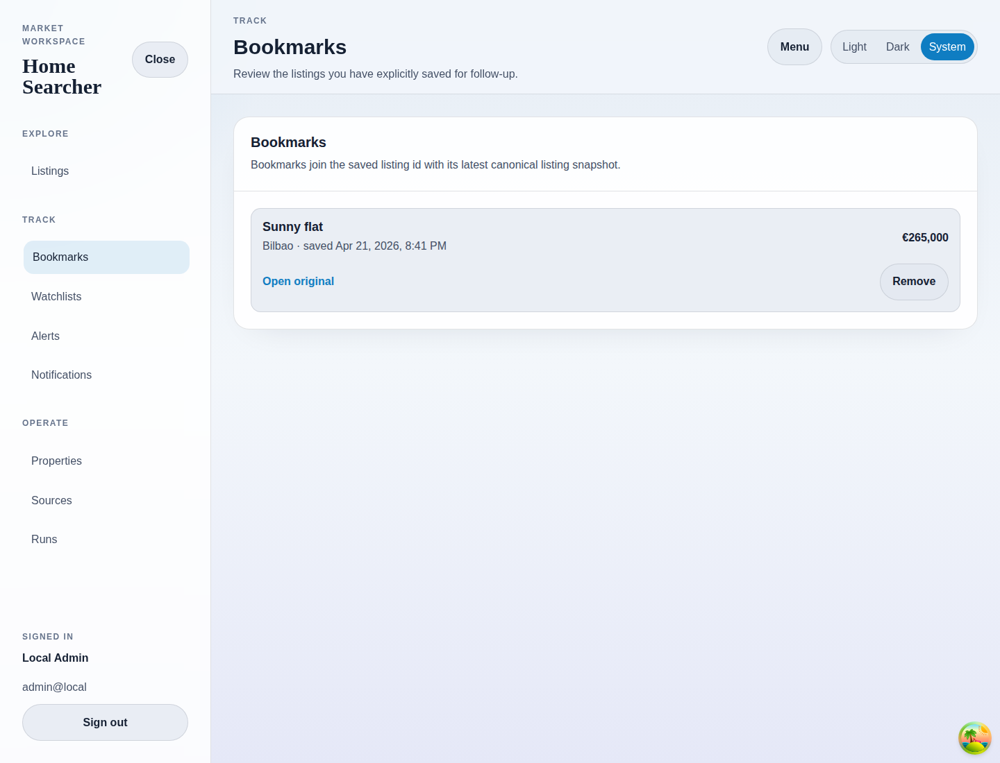

# Bookmarks

## Purpose
Review the saved listings tied to the current authenticated user.

## Screenshot

## UI Elements
### Element: Bookmark rows
- Type: interactive list
- Description: Shows saved listing title, location, saved timestamp, and current price.
- Behavior: Each row links back to detail and to the external listing source.

### Element: Remove
- Type: button
- Description: Deletes the bookmark.
- Behavior: Disables while the delete request is pending.

## User Actions
- Open a bookmarked listing → The listing detail page opens.
- Press Remove → The bookmark disappears after the query refreshes.
- Open with no bookmarks → The page shows its empty-state guidance.

## Navigation
- Previous: [Listing Detail](./04-listing-detail.md)
- Next: [Watchlists](./06-watchlists.md)
