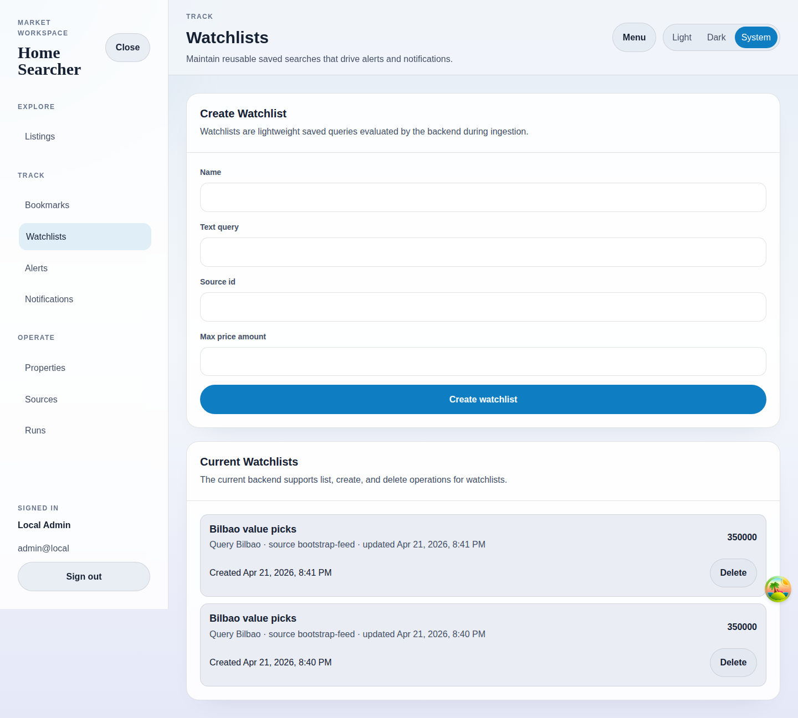

# Watchlists

## Purpose
Create reusable saved-search definitions that drive alerts and notifications.

## Screenshot

## UI Elements
### Element: Create Watchlist form
- Type: form
- Description: Captures name, text query, source id, and optional max price.
- Behavior: Creates a watchlist and resets the form on success.

### Element: Current Watchlists list
- Type: interactive list
- Description: Shows the stored watchlists with query summary, source id, updated time, and price ceiling.
- Behavior: Refreshes after create or delete.

### Element: Delete
- Type: button
- Description: Removes a watchlist.
- Behavior: Deletes the selected record from the backend.

## User Actions
- Create a watchlist for a source → The rule becomes available to alerts and future notifications.
- Delete a watchlist → The list refetches without the removed item.
- Leave fields blank or load while waiting → Form validation or loading states keep the workflow explicit.

## Navigation
- Previous: [Bookmarks](./05-bookmarks.md)
- Next: [Alert Rules](./07-alerts.md)
