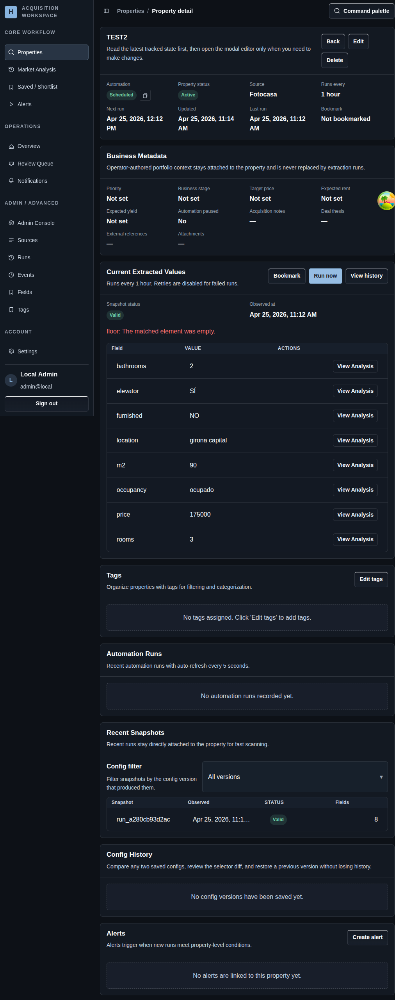

# Property Detail

## Screenshot

## What You Do Here
Inspect one tracked property, review its current extracted values, and only open editing controls when you actually need to change behavior.

## Quick Start
1. Review the latest extracted values first.
2. Check business metadata, tags, and alert coverage for operator context.
3. Use `Run now` when you need an immediate refresh.
4. Open `Edit` when you need to change selectors, schedule, metadata, or source assignment.
5. Review recent runs and snapshots after each important change.

## What To Check
- The page is read-first by default, with editing behind an explicit action.
- Recent automation runs refresh on a short interval so you can validate changes without leaving the page.
- Snapshot history is tied to config versions so you can tell which rules produced which values.

## Navigation
- Previous: [New Property](./05-bookmarks.md)
- Next: [Market Analysis](./07-alerts.md)
