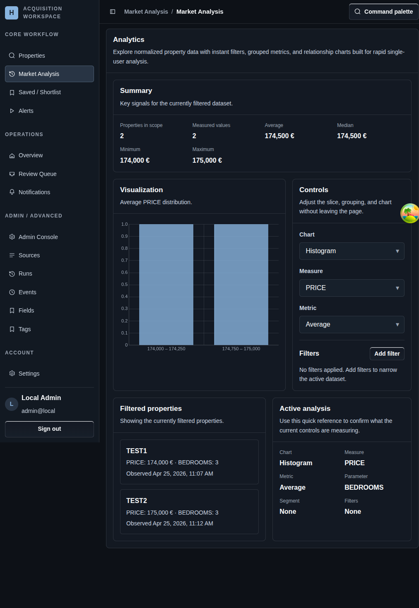

# Market Analysis

## Screenshot

## What You Do Here
Explore normalized property data as an aggregate view so you can compare the current slice without opening every tracked page individually.

## Quick Start
1. Open `Market Analysis` from the core workflow section.
2. Add one or more filters to narrow the active dataset.
3. Review the summary cards before changing the visualization.
4. Adjust chart and grouping controls without leaving the page.
5. Use the filtered property list to jump back into a tracked record when the aggregate view surfaces something interesting.

## What To Check
- This page is for comparison and pattern-finding, not direct editing.
- The active analysis panel explains what the current filters and controls are measuring.
- No filters means the analysis is operating on the current full dataset.

## Navigation
- Previous: [Property Detail](./06-watchlists.md)
- Next: [Saved / Shortlist](./08-notifications.md)
