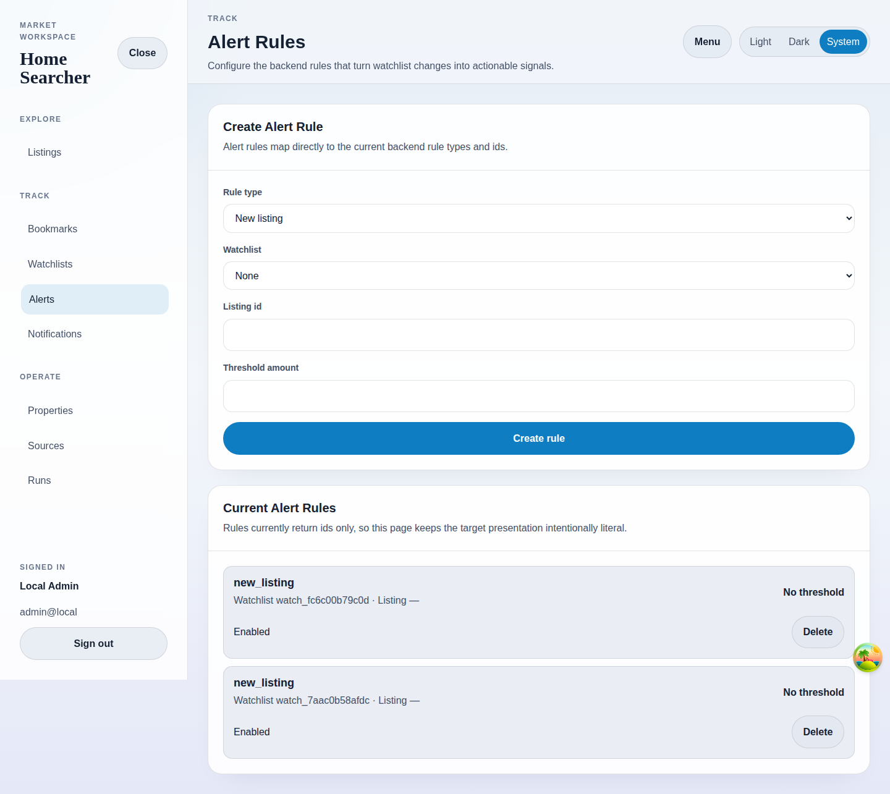

# Alert Rules

## Purpose
Map watchlists and listing identifiers to backend alert rules.

## Screenshot

## UI Elements
### Element: Rule type selector
- Type: selector
- Description: Chooses between new listing, price drop, and price-below-threshold rules.
- Behavior: Changes the semantics of the rule payload.

### Element: Watchlist selector
- Type: selector
- Description: Targets a stored watchlist.
- Behavior: Populates from the authenticated user's watchlists.

### Element: Listing id and threshold fields
- Type: inputs
- Description: Provide rule-specific targeting values.
- Behavior: Remain optional unless required by the chosen rule shape.

### Element: Current Alert Rules list
- Type: interactive list
- Description: Shows persisted rules with ids and enabled status.
- Behavior: Supports deletion.

## User Actions
- Create a rule for a watchlist → Future matching ingests create notifications.
- Delete a rule → The list updates after the mutation completes.
- Open before watchlists load → The page shows loading text for dependent data.

## Navigation
- Previous: [Watchlists](./06-watchlists.md)
- Next: [Notifications](./08-notifications.md)
