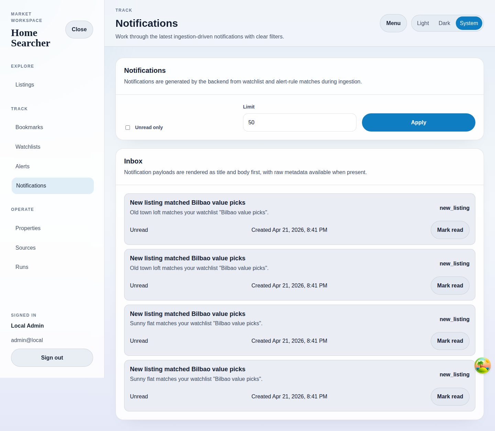

# Notifications

## Purpose
Show ingestion-driven notifications created by watchlist and alert-rule matches.

## Screenshot

## UI Elements
### Element: Notification filters
- Type: form
- Description: Filters the inbox by unread status and result limit.
- Behavior: Apply writes the current filter values into the URL.

### Element: Inbox list
- Type: interactive list
- Description: Shows title, body, rule kind, read status, and created timestamp.
- Behavior: Refreshes from the backend when filters or read state change.

### Element: Mark read
- Type: button
- Description: Marks a notification as read.
- Behavior: Removes the item from unread-only views after refetch.

## User Actions
- Apply unread-only filtering → Only unread notifications stay visible.
- Mark read → The selected notification updates its state.
- Load with no notifications → The page shows its empty-state message.

## Navigation
- Previous: [Alert Rules](./07-alerts.md)
- Next: [Tracked Properties](./09-properties.md)
