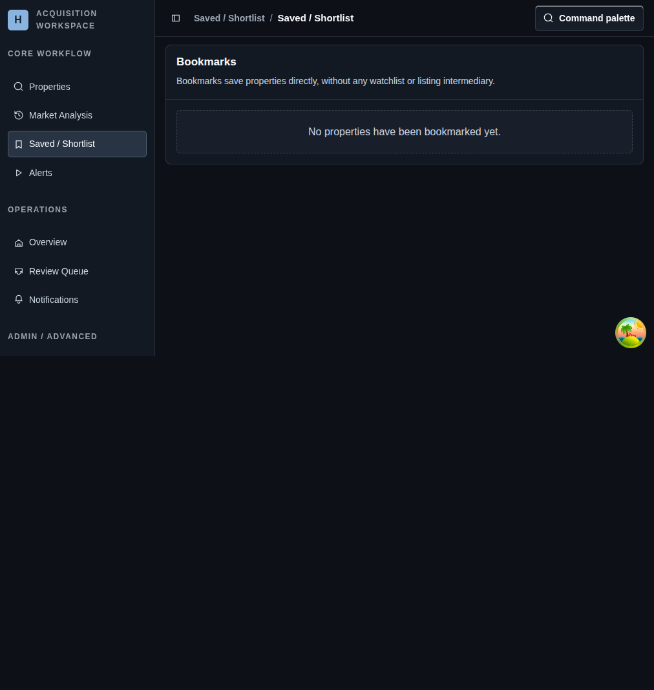

# Saved / Shortlist

## Screenshot

## What You Do Here
Review the properties you explicitly saved for follow-up without creating a separate watchlist or query layer.

## Quick Start
1. Save properties from the main list or the detail page.
2. Open `Saved / Shortlist` when you want to review only the manually shortlisted set.
3. Re-open a property when you need its full context again.
4. Remove saved items when they no longer deserve attention.

## What To Check
- Bookmarks are direct property saves tied to tracked properties.
- This route is best for a short human-curated list, not for automation.
- The shortlist works well as a handoff point into alerts or deeper property review.

## Navigation
- Previous: [Market Analysis](./07-alerts.md)
- Next: [Alerts](./09-properties.md)
