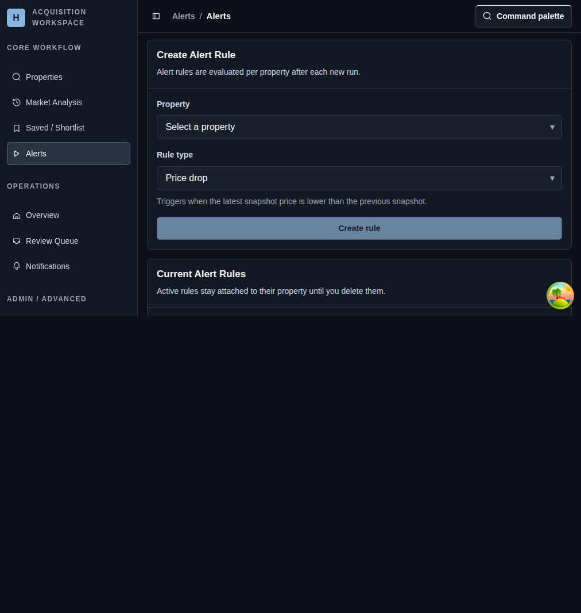

# Alerts

## Screenshot

## What You Do Here
Attach rule-driven monitoring to a property so the system can surface meaningful changes after each new run.

## Quick Start
1. Choose the target property.
2. Select the rule type that matches the condition you want to monitor.
3. Add a threshold when that rule type requires one.
4. Create the rule.
5. Review and delete outdated rules as the monitoring strategy changes.

## What To Check
- Rules are evaluated after each new property run.
- Active rules remain attached to their property until you delete them.
- This page creates the conditions that later drive notifications and triage items.

## Navigation
- Previous: [Saved / Shortlist](./08-notifications.md)
- Next: [Overview Dashboard](./10-add-property.md)
