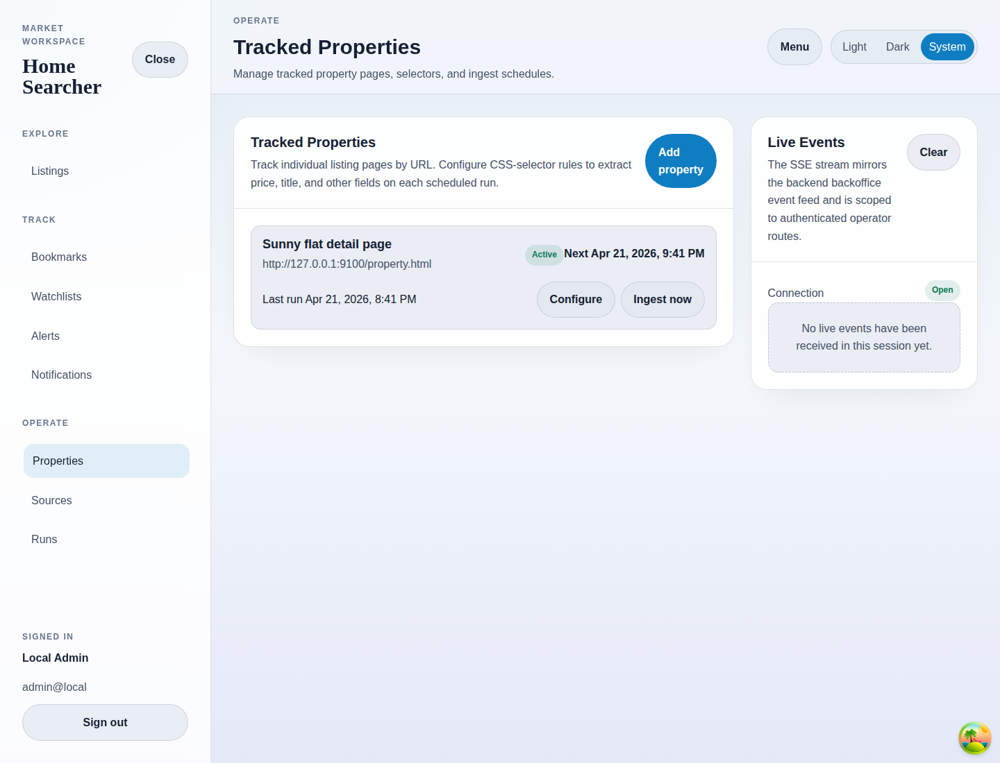

# Tracked Properties

## Purpose
List tracked property pages and expose manual ingest actions.

## Screenshot

## UI Elements
### Element: Tracked property rows
- Type: interactive list
- Description: Shows property label, URL, status, next run, last run, and actions.
- Behavior: Links to configuration and supports manual ingest.

### Element: Add property
- Type: link
- Description: Opens create mode for a new tracked page.
- Behavior: Navigates to `/properties/new`.

### Element: Live Events panel
- Type: status panel
- Description: Mirrors the authenticated SSE stream connection state.
- Behavior: Shows connection status and event items when present.

## User Actions
- Open Configure → The property detail screen opens.
- Press Ingest now → A new snapshot is requested immediately.
- Open before any properties exist → The page shows its empty-state guidance.

## Navigation
- Previous: [Notifications](./08-notifications.md)
- Next: [Add Property](./10-add-property.md)
