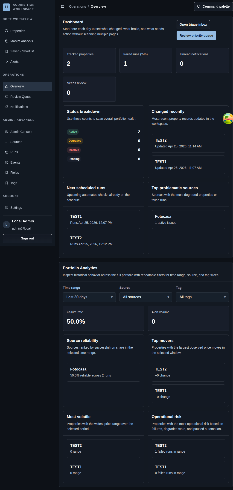

# Overview Dashboard

## Screenshot

## What You Do Here
Start the day from one summary page so you can see what changed, what broke, and what deserves attention before you start drilling into individual properties.

## Quick Start
1. Review the status breakdown first.
2. Check the recently changed properties and upcoming scheduled runs.
3. Scan the source health and portfolio analytics sections for broader patterns.
4. Open the triage inbox when the dashboard surfaces something that needs action.
5. Open a specific property only after the summary tells you where to look.

## What To Check
- The dashboard is intentionally read-first and cross-portfolio.
- It helps you choose the next page to open instead of trying to replace detailed workflows.
- The supporting analytics sections are useful for trend spotting, not for direct configuration changes.

## Navigation
- Previous: [Alerts](./09-properties.md)
- Next: [Review Queue](./11-property-detail.md)
