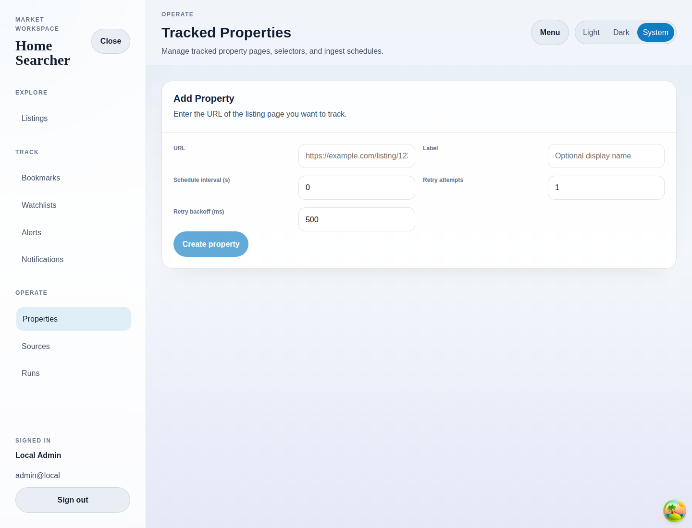

# Add Property

## Purpose
Register a property page URL for scheduled or manual extraction.

## Screenshot

## UI Elements
### Element: URL
- Type: input
- Description: Stores the property page that will be fetched for extraction.
- Behavior: Required before the create button enables.

### Element: Label
- Type: input
- Description: Provides a human-friendly name for the tracked property.
- Behavior: Optional but recommended for list readability.

### Element: Schedule and retry fields
- Type: numeric inputs
- Description: Configure polling interval, retry attempts, and retry backoff.
- Behavior: Persist directly to the backend property record.

### Element: Create property
- Type: button
- Description: Creates the property record.
- Behavior: Navigates to the new property detail route after success.

## User Actions
- Enter a valid URL and submit → The property is created and editable.
- Leave the URL blank → The button stays disabled.
- Receive a validation error → An inline error banner appears.

## Navigation
- Previous: [Tracked Properties](./09-properties.md)
- Next: [Property Detail](./11-property-detail.md)
