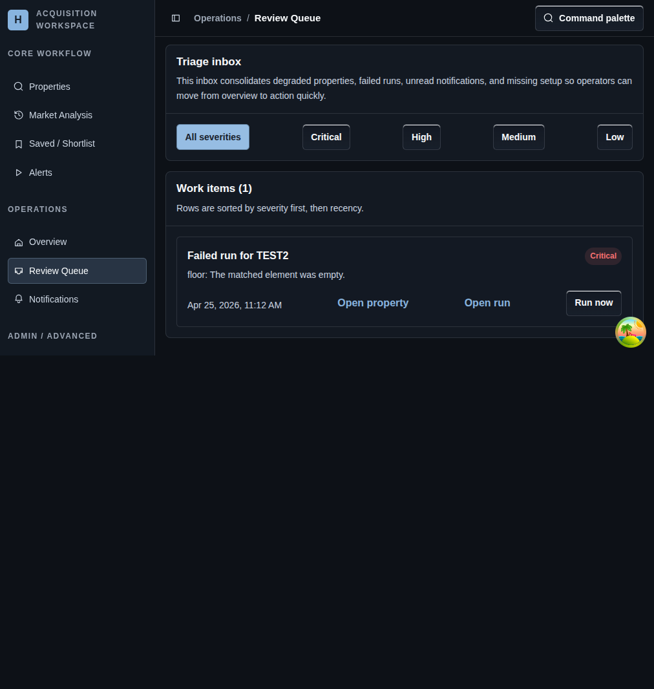

# Review Queue

## Screenshot

## What You Do Here
Work through the consolidated inbox of degraded properties, failed runs, unread notifications, and missing setup without hunting across several pages.

## Quick Start
1. Filter the queue by severity when you need a tighter work set.
2. Read each work item from top to bottom; rows are sorted by severity first and recency second.
3. Open the property or run linked to the item.
4. Use inline actions such as `Run now` or notification review when they are available.
5. Return to the queue after each fix until the highest-priority items are cleared.

## What To Check
- The queue is an action page, not a reporting page.
- It combines issues from properties, runs, notifications, and setup gaps into one list.
- Inline actions are there to reduce route switching for common fixes.

## Navigation
- Previous: [Overview Dashboard](./10-add-property.md)
- Next: [Notifications](./12-sources.md)
