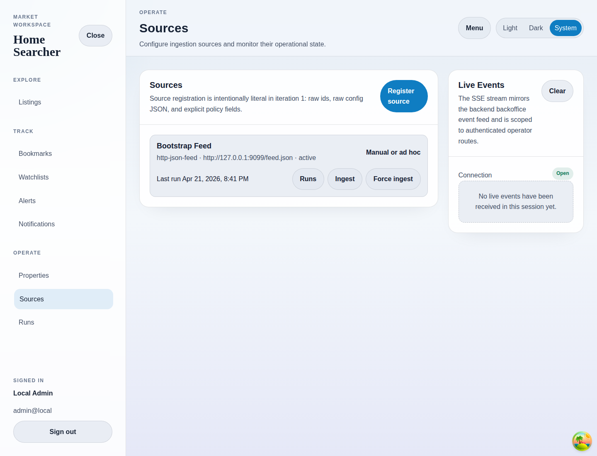

# Sources

## Purpose
List registered ingestion sources and expose manual ingest controls.

## Screenshot

## UI Elements
### Element: Source rows
- Type: interactive list
- Description: Shows source name, kind, endpoint, activity state, last run, and actions.
- Behavior: Links to source detail and to filtered runs.

### Element: Register source
- Type: link
- Description: Opens create mode for a new source definition.
- Behavior: Navigates to `/backoffice/sources/new`.

### Element: Ingest and Force ingest
- Type: buttons
- Description: Trigger source execution immediately.
- Behavior: Invalidate sources, runs, listings, and notifications after completion.

### Element: Live Events panel
- Type: status panel
- Description: Shows SSE connection state for backoffice operations.
- Behavior: Displays recent event payloads when received.

## User Actions
- Open a source row → The source editor loads.
- Trigger Ingest → A new run record appears in `/backoffice/runs`.
- Open the page with no sources → The empty state explains registration as the next step.

## Navigation
- Previous: [Property Detail](./11-property-detail.md)
- Next: [Register Source](./13-add-source.md)
