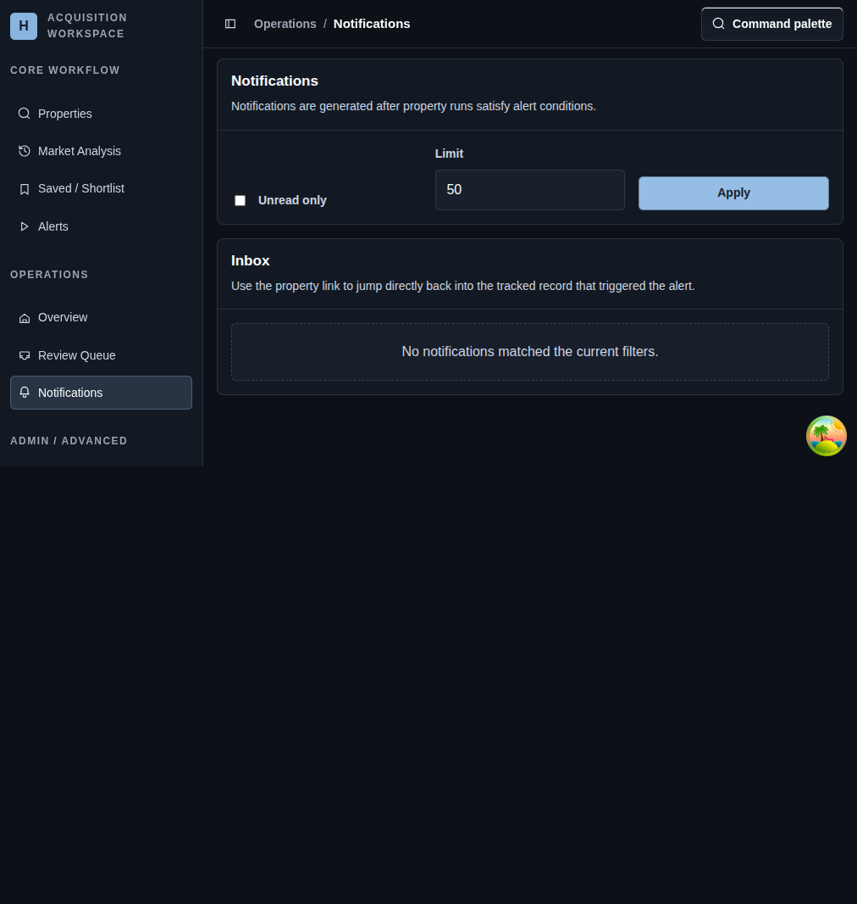

# Notifications

## Screenshot

## What You Do Here
Review alert outcomes after runs complete and jump back to the property that triggered the message.

## Quick Start
1. Set `Unread only` when you want to focus on new work.
2. Adjust the result limit if you need a larger or smaller inbox slice.
3. Apply the filters.
4. Read the notification title and body.
5. Open the related property or mark the notification read or unread.

## What To Check
- Notifications are created by alert conditions, not by manual note-taking.
- The inbox stays lightweight: filter, read, jump back to the property, and move on.
- This page is usually paired with alerts, review queue, and property detail.

## Navigation
- Previous: [Review Queue](./11-property-detail.md)
- Next: [Sources](./13-add-source.md)
