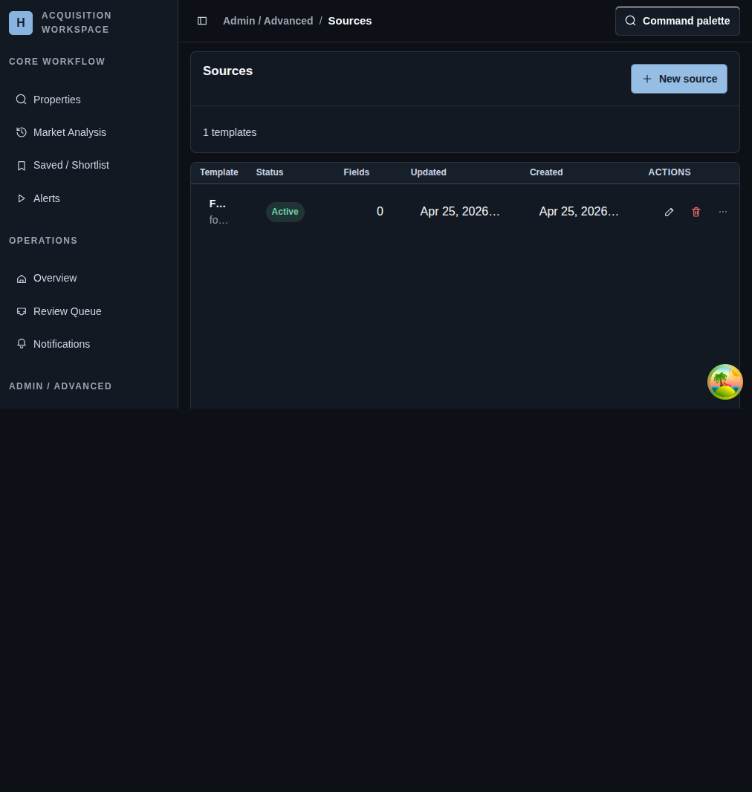

# Sources

## Screenshot

## What You Do Here
Manage reusable extraction templates that multiple properties can share.

## Quick Start
1. Review the source table for template status, field count, and timestamps.
2. Open a template when you need to inspect or change it.
3. Use `New source` when you need a fresh reusable template.
4. Use the row actions to delete a template or run all linked properties when you are validating a broad source change.

## What To Check
- Sources are shared extraction templates, not tracked properties.
- The list page keeps the important operational facts visible before you open a template.
- Bulk runs are tied to linked properties, so use them only after checking the impact of a template change.

## Navigation
- Previous: [Notifications](./12-sources.md)
- Next: [Template Detail](./14-source-detail.md)
