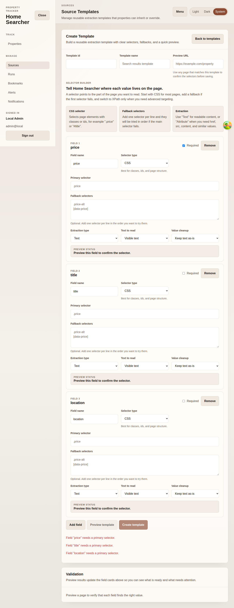

# Create Template

## Purpose
Create a reusable source template with the guided selector builder.

## Screenshot

## UI Elements
### Element: Template identity fields
- Type: inputs
- Description: Capture the template id, template name, and an optional preview URL.
- Behavior: Define the reusable template record and optional preview target.

### Element: Selector builder
- Type: structured form
- Description: Starts with common fields and explains selector type, extraction mode, fallback selectors, and required state in plain language.
- Behavior: Adds, removes, and edits typed selector fields without exposing raw JSON.

### Element: Validation
- Type: status panel
- Description: Shows readiness notes before the template is saved or previewed.
- Behavior: Keeps required selector details visible and blocks save actions until the builder is complete.

## User Actions
- Fill the identity fields and selector cards → The template becomes ready to save.
- Add or remove fields → The template structure updates immediately.
- Leave required selector details incomplete → Inline validation explains what still needs attention.

## Navigation
- Previous: [Sources](./12-sources.md)
- Next: [Source Detail](./14-source-detail.md)
