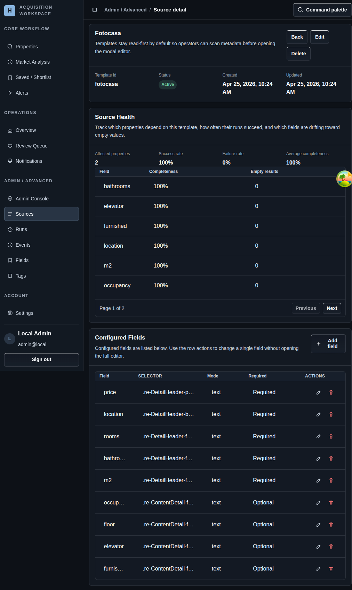

# Template Detail

## Screenshot

## What You Do Here
Inspect an existing source template, review its field structure, and update selectors only when the source layout has changed.

## Quick Start
1. Open the template from the source list.
2. Review the saved field set and metadata first.
3. Open the edit flow when selectors or preview behavior need attention.
4. Use the preview controls to confirm the current page structure still matches the template.
5. Save or delete the template when the change is complete.

## What To Check
- Existing templates stay read-first until you intentionally open editing.
- The same structured selector model is used for both create and edit flows.
- Validation belongs to the template itself, so fix selector quality here before changing linked properties one by one.

## Navigation
- Previous: [Sources](./13-add-source.md)
- Next: [Runs](./15-runs.md)
