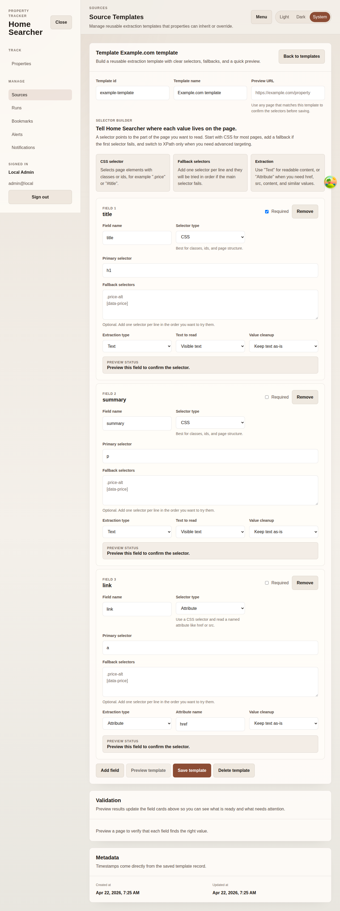

# Source Detail

## Purpose
Edit an existing source template, review its selector fields, and confirm it is ready for downstream property use.

## Screenshot

## UI Elements
### Element: Template identity
- Type: form
- Description: Shows the stored template id in read-only mode plus editable name and preview URL fields.
- Behavior: Saves changes through the backend upsert route.

### Element: Selector builder
- Type: structured form
- Description: Shows typed selector cards with field names, selector types, extraction modes, optional fallback selectors, and required flags.
- Behavior: Saves a structured selector payload back into the template config JSON.

### Element: Validation
- Type: status panel
- Description: Summarizes whether the current template is ready for preview or save.
- Behavior: Shows any outstanding selector issues directly under the form.

### Element: Metadata
- Type: data panel
- Description: Shows created and updated timestamps for the template record.
- Behavior: Reflects backend source record values.

## User Actions
- Edit selector fields and save → The backend template record updates.
- Review validation hints → Operators can confirm whether the selector cards are complete.
- Review timestamps → Operators can verify when the template was last changed.

## Navigation
- Previous: [Create Template](./13-add-source.md)
- Next: [Runs](./15-runs.md)
