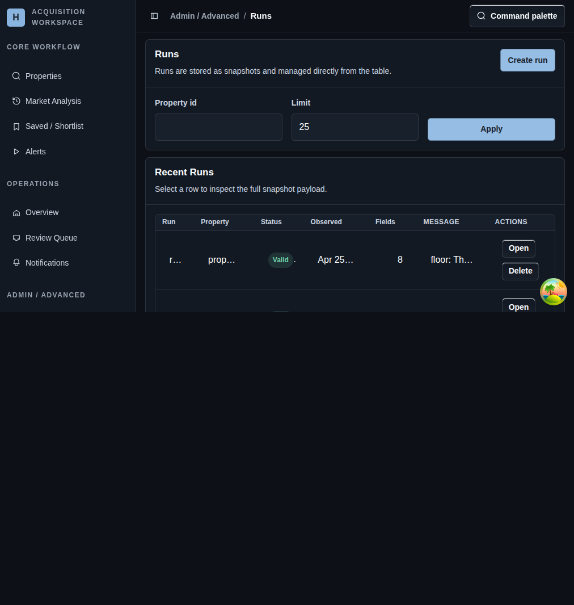

# Runs

## Screenshot

## What You Do Here
Review stored snapshots, trigger a manual run, and jump into a detailed comparison when something changed or failed.

## Quick Start
1. Filter the list by property id or result limit.
2. Apply the filters.
3. Open a run row when you need the full snapshot detail.
4. Use `Create run` when you want an immediate manual check for a selected property.
5. Delete a stored run only when the snapshot should no longer exist.

## What To Check
- The runs table is a snapshot history surface, not just a live execution log.
- Row selection is the fastest path into full comparison detail.
- Manual runs are useful after a selector or template change when you want fast verification.

## Navigation
- Previous: [Template Detail](./14-source-detail.md)
- Next: [Run Detail](./16-run-detail.md)
