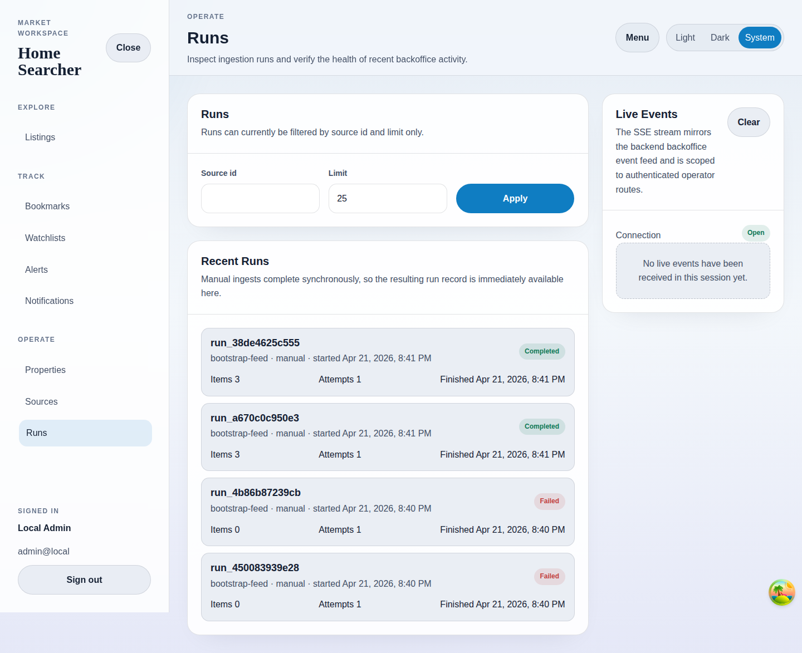

# Runs

## Purpose
Browse recent ingestion runs and filter them by source.

## Screenshot

## UI Elements
### Element: Run filters
- Type: form
- Description: Filters recent runs by source id and limit.
- Behavior: Apply updates the URL-backed filters.

### Element: Recent Runs list
- Type: interactive list
- Description: Shows run id, source id, trigger kind, status, items, attempts, and finish time.
- Behavior: Links each run to its detail page.

### Element: Live Events panel
- Type: status panel
- Description: Surfaces SSE connection state for operator workflows.
- Behavior: Displays events when the backend emits them during the session.

## User Actions
- Filter by source id → The list narrows to matching runs.
- Open a completed or failed run → The run detail screen opens.
- Load with no matching runs → The page shows its empty-state guidance.

## Navigation
- Previous: [Source Detail](./14-source-detail.md)
- Next: [Run Detail](./16-run-detail.md)
