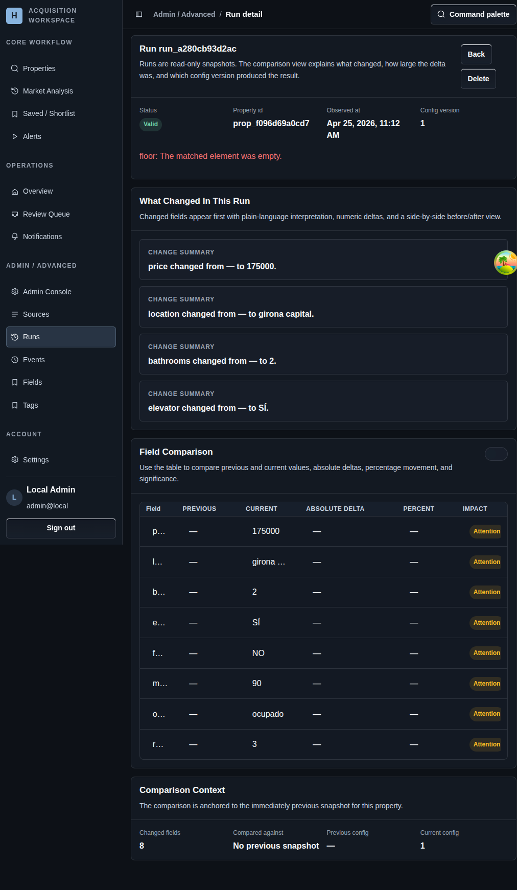

# Run Detail

## Screenshot

## What You Do Here
Inspect one stored snapshot, compare it with the previous snapshot, and decide whether the change is expected or needs follow-up.

## Quick Start
1. Review run status, property id, observed time, and config version.
2. Read the plain-language change summary first.
3. Use the field comparison table to inspect previous and current values.
4. Toggle unchanged fields on when you need a full before-and-after view.
5. Check the comparison context to see which previous snapshot anchors the result.

## What To Check
- The detail page is read-only; it exists to explain what changed, not to edit anything.
- Comparison is anchored to the immediately previous property snapshot when one exists.
- The run detail page is the best place to verify whether a template or selector change produced the expected output.

## Navigation
- Previous: [Runs](./15-runs.md)
- Next: [Admin Surfaces](./17-property-tracking-workflow.md)
