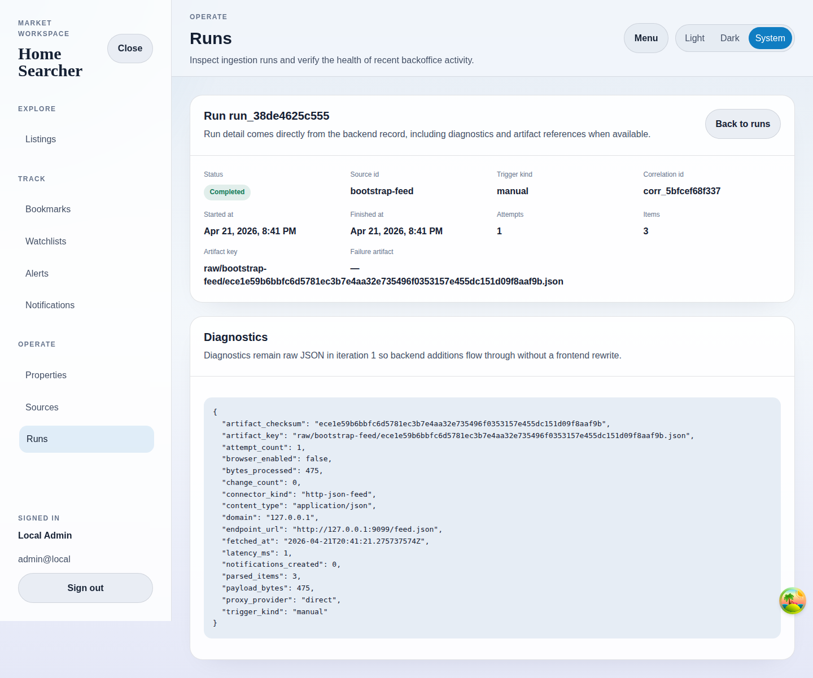

# Run Detail

## Purpose
Inspect one ingestion run, including backend diagnostics and artifact references.

## Screenshot

## UI Elements
### Element: Metadata grid
- Type: data panel
- Description: Shows status, source id, trigger kind, correlation id, timing, attempts, items, and artifact keys.
- Behavior: Renders the full backend run record.

### Element: Diagnostics block
- Type: code panel
- Description: Shows raw diagnostics JSON.
- Behavior: Exposes backend fields without client-side reshaping.

### Element: Back to runs
- Type: link
- Description: Returns to the run list.
- Behavior: Navigates back to `/backoffice/runs`.

## User Actions
- Review a completed run → Confirm artifact location, item count, and timing.
- Review a failed run → Inspect raw failure diagnostics and failure-artifact keys.
- Return to runs → Continue monitoring broader run history.

## Navigation
- Previous: [Runs](./15-runs.md)
- Next: [Property Tracking Workflow](./17-property-tracking-workflow.md)
