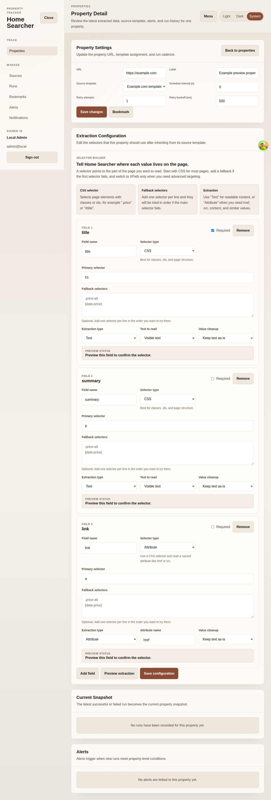

# Property Tracking Workflow

## Purpose
Document the end-to-end operator workflow for adding a property, configuring selectors, validating extraction, and activating tracking.

## Screenshot

## UI Elements
### Element: Add Property step
- Type: workflow step
- Description: Starts with the add-property form.
- Behavior: Creates a tracked property record from a target URL.

### Element: Selector configuration step
- Type: workflow step
- Description: Uses the property detail selector builder and any inherited source template fields.
- Behavior: Stores typed selectors for fields such as title, summary, price, and links.

### Element: Validation step
- Type: workflow step
- Description: Uses Preview extraction and Current Snapshot.
- Behavior: Shows live extracted values when available and persisted values after ingest.

### Element: Monitoring step
- Type: workflow step
- Description: Uses the properties list and run history.
- Behavior: Shows property status, next run, last run, and downstream ingest evidence.

## User Actions
- Add a property in [Add Property](./10-add-property.md) → A new property detail route is created.
- Adjust selectors in [Property Detail](./11-property-detail.md) → Structured extraction rules are versioned.
- Run preview → Extracted values confirm whether the selectors match the page when the preview target is reachable.
- Press Ingest now → Tracking becomes active through a persisted snapshot.
- Look for a visual DOM selector → This workflow does not exist in the current UI; the shipped product uses the manual selector builder only.

## Navigation
- Previous: [Run Detail](./16-run-detail.md)
- Next: [Market Monitoring Workflow](./18-market-monitoring-workflow.md)
