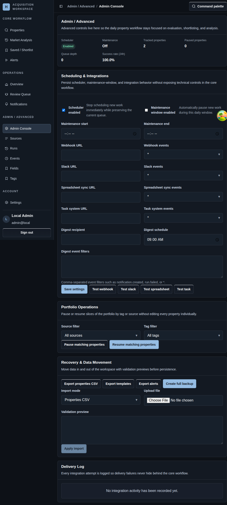

# Admin Surfaces

## Screenshot

## What You Do Here
Use the workspace-level admin tools for platform settings, imports, integration tests, and the specialist routes that support daily operator work.

## Quick Start
1. Open `Admin Console` when the change affects the workspace rather than one property.
2. Review platform summary and settings before making broad operational changes.
3. Use `Sources` and `Runs` for template and snapshot management.
4. Use `Events` when you need live in-session backoffice activity.
5. Use `Fields` and `Tags` to maintain shared schema and categorization.
6. Use `Settings` for account, password, appearance, and notification preferences.

## What To Check
- Admin actions can affect many properties at once, so confirm the target scope before you submit them.
- Import, pause, and integration-test controls are workspace-level tools, not property-level edits.
- The specialist routes under the same navigation group are meant to support the main property workflow, not replace it.

## Navigation
- Previous: [Run Detail](./16-run-detail.md)
- Next: [Property Tracking Tutorial](./18-market-monitoring-workflow.md)
