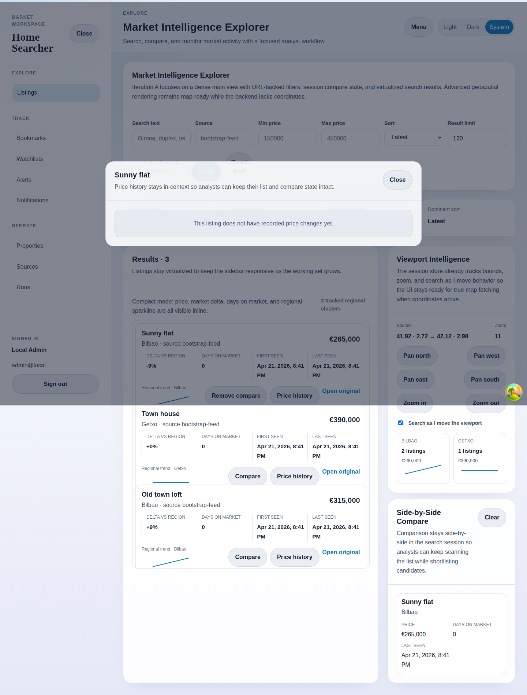

# Market Monitoring Workflow

## Purpose
Document the real workflow for browsing listings, saving targets, creating saved searches, and monitoring resulting notifications and runs.

## Screenshot

## UI Elements
### Element: Explorer step
- Type: workflow step
- Description: Uses the listings page filters, compare tray, and price-history modal.
- Behavior: Helps operators shortlist listings without leaving the main explorer.

### Element: Saved tracking step
- Type: workflow step
- Description: Uses bookmarks, watchlists, and alert rules.
- Behavior: Converts interesting inventory into personal tracking rules.

### Element: Notification step
- Type: workflow step
- Description: Uses the notifications inbox.
- Behavior: Surfaces ingest-time matches from watchlists and alert rules.

### Element: Backoffice verification step
- Type: workflow step
- Description: Uses sources and runs.
- Behavior: Confirms whether an ingest completed successfully and what it processed.

## User Actions
- Filter and compare listings in [Listings Explorer](./03-listings.md) → Shortlist a candidate.
- Open listing detail and bookmark it → The listing becomes part of the personal saved set.
- Create a watchlist and alert rule → Future ingests produce notifications.
- Review notifications and runs → Confirm what changed and whether the ingestion pipeline stayed healthy.

## Navigation
- Previous: [Property Tracking Workflow](./17-property-tracking-workflow.md)
- Next: [Shared UI States](./19-shared-ui-states.md)
