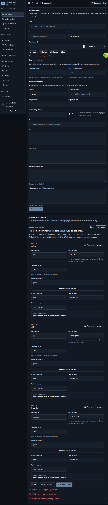

# Property Tracking Tutorial

## Screenshot

## Goal
Track one page from its URL through the first verified run without creating extra records you do not need.

## Steps
1. Start from [Properties Workspace](./04-listing-detail.md) and open [New Property](./05-bookmarks.md).
2. Enter the property URL and the run cadence you want.
3. Add selector fields and fallback selectors for the values you care about.
4. Save the property and its first config.
5. Open [Property Detail](./06-watchlists.md) and review the read-first summary.
6. Use `Run now` to verify the current configuration against the live page.
7. Review [Runs](./15-runs.md) and [Run Detail](./16-run-detail.md) if the output needs explanation.
8. Add alerts only after the extraction output is stable enough to monitor.

## Practical Checks
- Start with the smallest useful field set and grow it only when the operator really needs more data.
- Fix template or selector quality before layering alerts and daily review on top.
- The current app uses a structured selector builder; there is no visual DOM selector workflow.

## Navigation
- Previous: [Admin Surfaces](./17-property-tracking-workflow.md)
- Next: [Monitoring Tutorial](./19-shared-ui-states.md)
