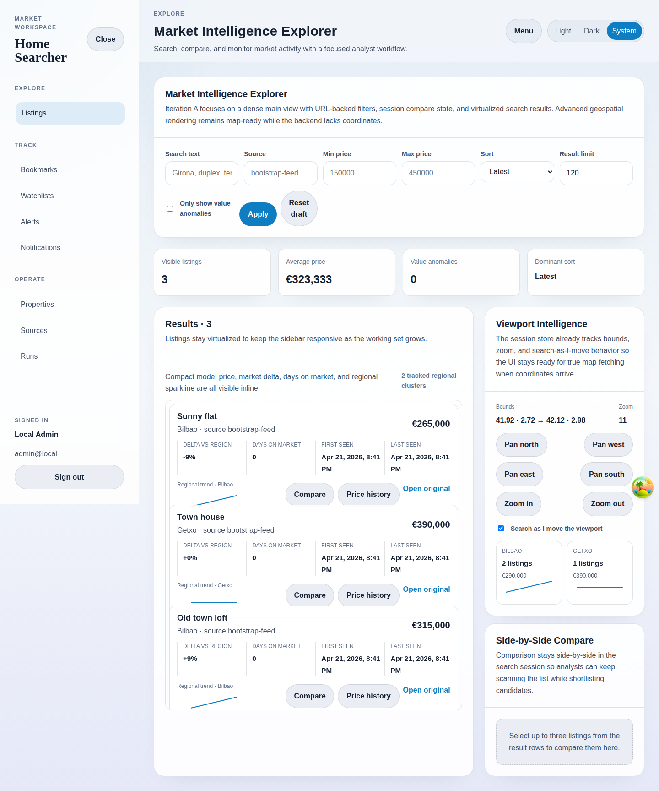

# Shared UI States

## Purpose
Capture the reusable loading, empty, success, and failure patterns that appear across the documented screens.

## Screenshot

## UI Elements
### Element: Loading states
- Type: status copy
- Description: Pages such as listings, bookmarks, properties, sources, and runs show explicit loading text while data is fetched.
- Behavior: Keeps the shell stable until the query resolves.

### Element: Empty states
- Type: status message
- Description: Lists and panels explain when there are no bookmarks, no compare items, no notifications, no live events, or no recorded price changes.
- Behavior: Guides the operator toward the next useful action.

### Element: Success states
- Type: status badge and result panels
- Description: Examples include completed runs, valid property snapshots, and successful extraction previews.
- Behavior: Confirm that the last action produced usable output.

### Element: Error and degraded states
- Type: error banner or status badge
- Description: Login failures, query failures, failed runs, preview failures, and temporarily unavailable live updates are surfaced directly in-page.
- Behavior: Preserve the route while showing the failure reason.

## User Actions
- Wait for a list to load → The page replaces loading copy with fetched content.
- Reach an empty collection → Read the guidance and move to the linked creation workflow.
- Hit a failed run or failed request → Inspect the surfaced error details, then retry from the relevant screen.

## Navigation
- Previous: [Market Monitoring Workflow](./18-market-monitoring-workflow.md)
- Next: [Documentation index](../index.md)
