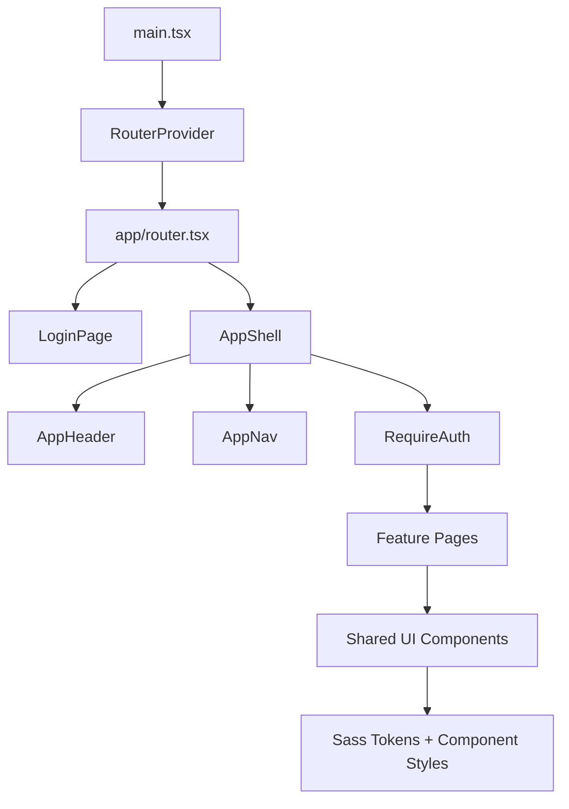
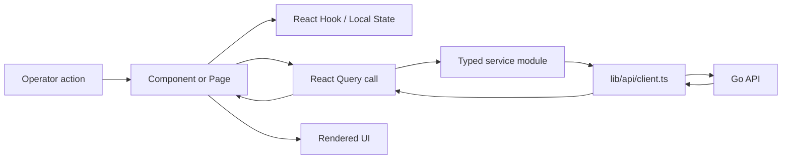
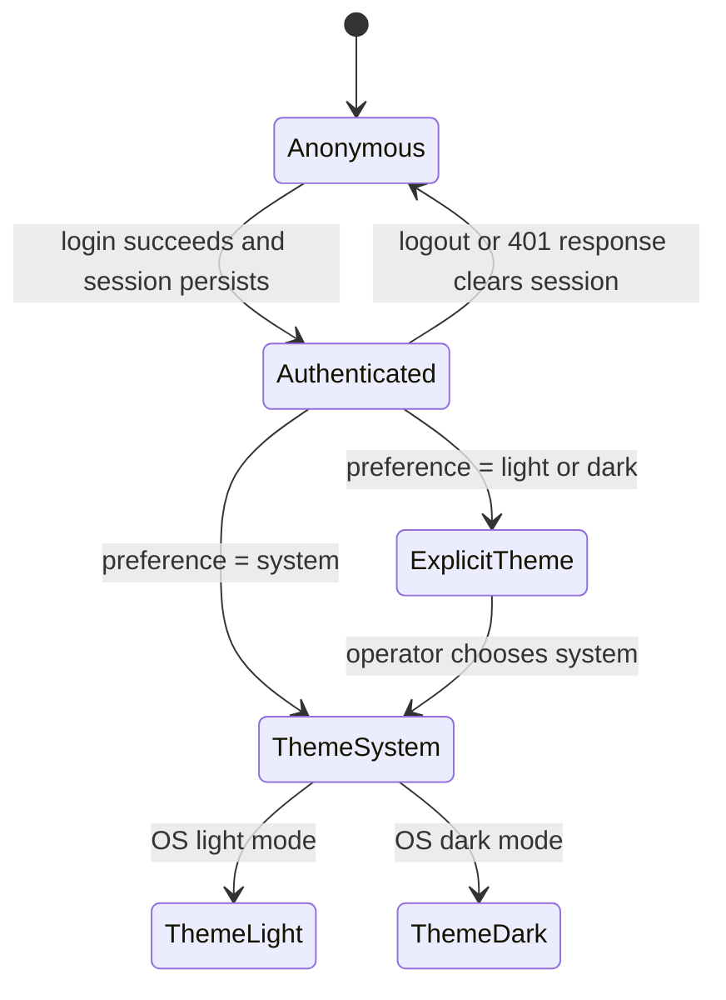

# Frontend Architecture Overview

Nido's frontend is a React 19 + Vite application in `/app` that renders authenticated operator workflows and communicates with the Go backend through typed service modules.

## System boundaries

| Layer | Primary files | Responsibility | Related docs |
| --- | --- | --- | --- |
| Browser entry | `app/src/main.tsx` | Mount React, global Sass, and router provider | [App Overview](../../app/docs/overview.md) |
| App composition | `app/src/app/*` | Route tree, providers, shell, auth guard, error boundary | [UI Architecture](../../app/docs/ui-architecture.md) |
| Feature workflows | `app/src/features/*` | Page-level workflows for properties, analytics, fields, engagement, settings, operations, auth, and backoffice | [Codebase Navigation](./codebase-navigation.md) |
| Design system | `app/src/components/*`, `app/src/styles/*` | Shared UI primitives, shell chrome, Sass tokens, and component styles | [Components](../../app/docs/components.md) |
| Data services | `app/src/services/*`, `app/src/lib/api/client.ts` | Typed API contracts, React Query keys, request execution, and error normalization | [API contracts](#api-contracts) |
| Client state | `app/src/stores/*`, `app/src/hooks/useTheme.tsx` | Persisted session, shell state, theme preference, and local UI coordination | [State Management](../../app/docs/state-management.md) |

## Component hierarchy

## Data flow

## State boundaries

| State owner | Storage | Mutators | Consumers | Critical constraint |
| --- | --- | --- | --- | --- |
| Session | Zustand persisted storage key `nido.session` | `setSession`, `clearSession`, API 401 reset | `RequireAuth`, `apiRequest`, login/logout UI | Protected routes must remain inside `RequireAuth`. |
| Theme | `localStorage` key `nido-theme` + document `data-theme` | `ThemeProvider`, `ThemeToggle` | Sass theme selectors and shell UI | System mode must subscribe to OS changes and clean up listeners. |
| Shell UI | Zustand in-memory store | navigation and command interactions | App shell and operator pages | Cross-route UI state should not carry backend business data. |
| Server state | React Query cache | Service modules and query keys | Feature pages | Query keys must include every variable that changes the result. |
| URL/table state | URL search params and localStorage | feature-specific helpers | property and list pages | Persisted columns must be reconciled with the current schema. |

## External integrations

| Integration | Frontend entry point | Contract |
| --- | --- | --- |
| Backend API | `app/src/lib/api/client.ts` | Uses `VITE_API_ORIGIN` when provided, sends JSON by default, clears client auth on HTTP 401. |
| Browser storage | session/theme/table helpers | Stores only client preferences and session metadata required by the UI. |
| Chart.js | analytics and property chart components | Receives normalized time-series data from feature utilities. |
| React Query | feature pages and services | Coordinates loading, error, caching, and mutation invalidation. |

## API contracts

| Domain | Service files | Output shape | Consumers |
| --- | --- | --- | --- |
| Auth | `services/auth/*` | login/session response types and keys | `LoginPage`, `RequireAuth`, API client |
| Properties | `services/properties/*` | properties, fields, price history, comparison, and preview payloads | property pages, charts, selector builder |
| Backoffice sources/runs | `services/backoffice-*/*` | source templates, run summaries, run details | backoffice pages and editor dialogs |
| Fields/tags | `services/fields/*`, `services/tags/*` | field library and tag records | field, property, and tag workflows |
| Engagement | `services/bookmarks/*`, `services/notifications/*`, `services/alert-rules/*` | bookmarks, notifications, alerts | engagement pages and property actions |
| Analytics/platform/backup | `services/analytics/*`, `services/platform/*`, `services/backup/*` | dashboards, platform health, backup operations | analytics and settings pages |

## Design decisions

- The router is the source of truth for page ownership and auth boundaries.
- Service modules own backend paths and response typing; components should not construct backend URLs directly.
- Shared UI primitives keep accessibility and visual behavior centralized.
- File headers are treated as source-level navigation maps and must link to this documentation layer.

## Related

- [Frontend Hub](./README.md)
- [Development Setup](./development-setup.md)
- [Production Setup](./production-setup.md)
- [Codebase Navigation](./codebase-navigation.md)
- [Documentation Template](./documentation-template.md)
