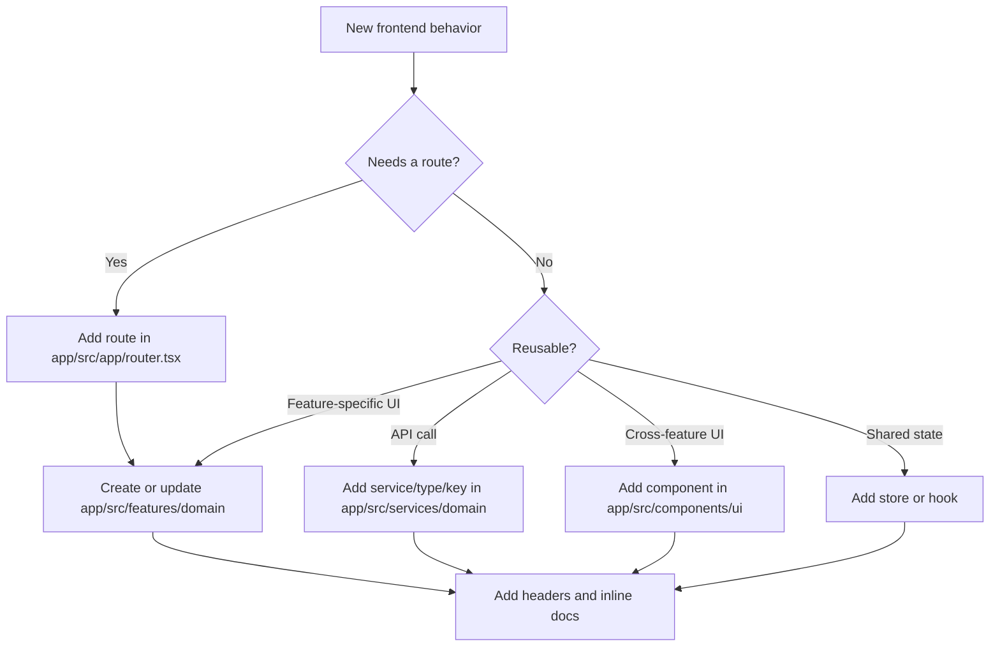

# Frontend Codebase Navigation Guide

## Folder structure

| Path | Ownership | Add new work here when |
| --- | --- | --- |
| `app/src/main.tsx` | Browser entry | Changing bootstrap, root styles, or router provider mounting. |
| `app/src/app` | Application composition | Changing route hierarchy, auth boundary, providers, shell, or route-level error behavior. |
| `app/src/components/ui` | Shared UI primitives | Adding reusable controls, surfaces, tables, feedback, or layout primitives. |
| `app/src/components/shell` | Navigation and shell chrome | Changing global navigation, header actions, theme controls, or shell labels. |
| `app/src/components/selectors`, `app/src/components/tags` | Feature-adjacent shared components | Adding reusable widgets that are specific to selectors or tags. |
| `app/src/features` | Page workflows | Adding route-level behavior or feature-specific utilities. |
| `app/src/services` | API contracts | Adding backend endpoints, query keys, request helpers, or shared response types. |
| `app/src/lib` | Cross-feature utilities | Adding reusable browser, auth, API, formatting, form, routing, or UI helpers. |
| `app/src/stores` | Shared client state | Adding cross-route state that cannot remain local to a component. |
| `app/src/hooks` | Shared React hooks | Adding reusable hook behavior with explicit state and side effects. |
| `app/src/styles` | Sass design system | Adding tokens, mixins, base rules, or component-level style modules. |
| `app/src/test` | Test setup | Changing Vitest or Testing Library global setup. |

## Naming conventions

| Item | Convention | Example |
| --- | --- | --- |
| Route page component | `FeaturePage.tsx` | `PropertiesPage.tsx` |
| Dialog component | `ActionDialog.tsx` | `PropertyAlertCreateDialog.tsx` |
| Feature utility | `camelCase.ts` | `propertyTableState.ts` |
| Tests | `Subject.test.tsx` or `Subject.test.ts` | `DataTable.test.tsx` |
| Service module | `domain.service.ts` | `properties.service.ts` |
| Query keys | `domain.keys.ts` | `tags.keys.ts` |
| Types | `domain.types.ts` | `analytics.types.ts` |
| Sass partial | `_name.scss` | `_spacing.scss` |

## Where to implement new features

## Required documentation touchpoints

| Change type | Required documentation |
| --- | --- |
| New source file | File header from [Documentation Template](./documentation-template.md). |
| New component | Component comment covering purpose, rendering, state, side effects, and performance. |
| New non-trivial function | Function comment covering purpose, parameters, return, side effects, and edge cases. |
| Changed critical logic | Inline critical-point annotation explaining why the logic exists and failure impact. |
| New feature workflow | Update feature docs under `app/docs/features` and cross-link from the file header. |
| New service/API contract | Update [Architecture Overview API contracts](./architecture-overview.md#api-contracts). |
| New setup/deployment requirement | Update [Development Setup](./development-setup.md) or [Production Setup](./production-setup.md). |

## Related

- [Frontend Hub](./README.md)
- [Architecture Overview](./architecture-overview.md)
- [Documentation Template](./documentation-template.md)
- [App Components](../../app/docs/components.md)
