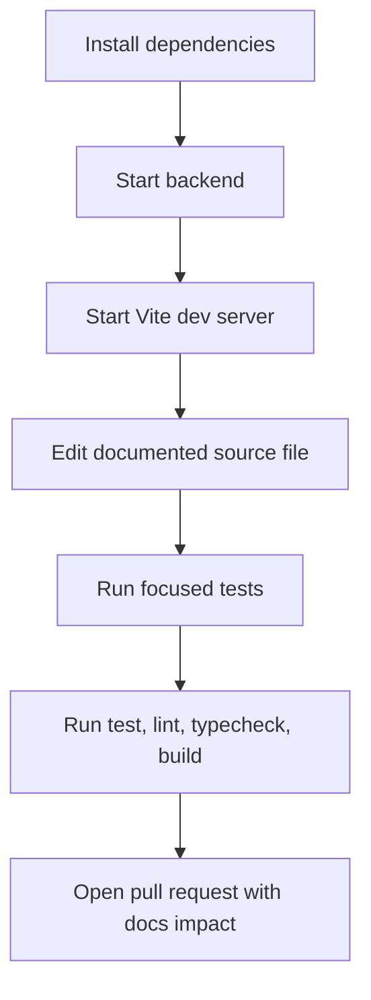

# Frontend Development Setup Guide

## Prerequisites

| Tool | Required version | Reason |
| --- | --- | --- |
| Node.js | `>=22.14.0` | Matches `app/package.json` engine and Vite toolchain expectations. |
| pnpm | `10.6.1` through Corepack | Matches the committed package manager metadata. |
| Go backend | Repository `/server` app | Local frontend proxies API calls to the backend during development. |
| Git | Current stable | Required for branch-based contribution workflow. |

## Installation

```bash
cd /home/runner/work/nido/nido/app
corepack enable
corepack pnpm install
```

## Environment variables

| Variable | Used by | Development behavior |
| --- | --- | --- |
| `VITE_API_ORIGIN` | `app/src/lib/api/client.ts` | Optional. Leave blank when Vite proxy should send `/api` requests to the local backend. Set to an absolute origin when testing another backend. |

Backend variables such as `NIDO_DATABASE_PATH`, `NIDO_BACKUP_DIR`, `AUTO_MIGRATE`, and `MIGRATION_STRATEGY` are documented in the root [README](../../README) and backend docs. They affect frontend behavior only through API responses.

## Local development workflow



1. Start the backend:

   ```bash
   cd /home/runner/work/nido/nido
   go run /home/runner/work/nido/nido/server/cmd/server
   ```

2. Start the frontend:

   ```bash
   cd /home/runner/work/nido/nido/app
   corepack pnpm dev
   ```

3. Open `http://127.0.0.1:3000`.

4. Validate changes:

   ```bash
   cd /home/runner/work/nido/nido/app
   corepack pnpm test
   corepack pnpm lint
   corepack pnpm typecheck
   corepack pnpm exec vite build
   ```

## Documentation workflow

- New files must be created with the standard header from [Documentation Template](./documentation-template.md).
- Modified components must update component-level comments when rendering, state, side effects, or performance behavior changes.
- Modified functions must update function-level documentation when parameters, return values, side effects, or edge-case behavior changes.
- Modified critical logic must explain why the branch exists and what breaks if changed incorrectly.

## Related

- [Frontend Hub](./README.md)
- [Architecture Overview](./architecture-overview.md)
- [Codebase Navigation](./codebase-navigation.md)
- [Developer Workflow](../guides/developer-workflow.md)
