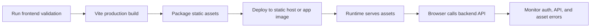

# Frontend Production Setup Guide

## Build process

```bash
cd /home/runner/work/nido/nido/app
corepack pnpm install --frozen-lockfile
corepack pnpm test
corepack pnpm lint
corepack pnpm typecheck
corepack pnpm exec vite build
```

The production artifact is emitted by Vite under `app/.dist`.

## Production environment configuration

| Variable | Required | Description | Risk if misconfigured |
| --- | --- | --- | --- |
| `VITE_API_ORIGIN` | Deployment-dependent | Absolute backend origin for the browser bundle. Leave empty only when the hosting layer proxies `/api` to the backend. | Requests may target the wrong origin or fail CORS/preflight checks. |
| Backend runtime variables | Yes for backend host | Database, backup, auth, and migration configuration consumed by `/server`. | Frontend may render errors from unavailable or unsafe backend runtime. |

## Deployment workflow



1. Validate the branch using the commands in [Development Setup](./development-setup.md#local-development-workflow).
2. Build the frontend with Vite.
3. Serve `app/.dist` through the chosen static host, reverse proxy, or application image.
4. Ensure `/api` requests are routed to the backend or `VITE_API_ORIGIN` points at the backend origin.
5. Confirm login, dashboard load, one list page, and one mutation workflow in the production environment.

## Runtime considerations

| Concern | Operational rule |
| --- | --- |
| Auth expiry | HTTP 401 responses clear the persisted frontend session through `apiRequest`. |
| Cache freshness | React Query invalidation must be updated with service mutations. |
| Theme | `data-theme` is written to `document.documentElement` and should not be overridden by host CSS. |
| Static assets | Cache Vite hashed assets aggressively; avoid caching `index.html` beyond the deployment window. |
| Documentation parity | Production runbooks should link back to these docs when frontend behavior or environment variables change. |

## Related

- [Frontend Hub](./README.md)
- [Architecture Overview](./architecture-overview.md)
- [Development Setup](./development-setup.md)
- [Root README](../../README)
