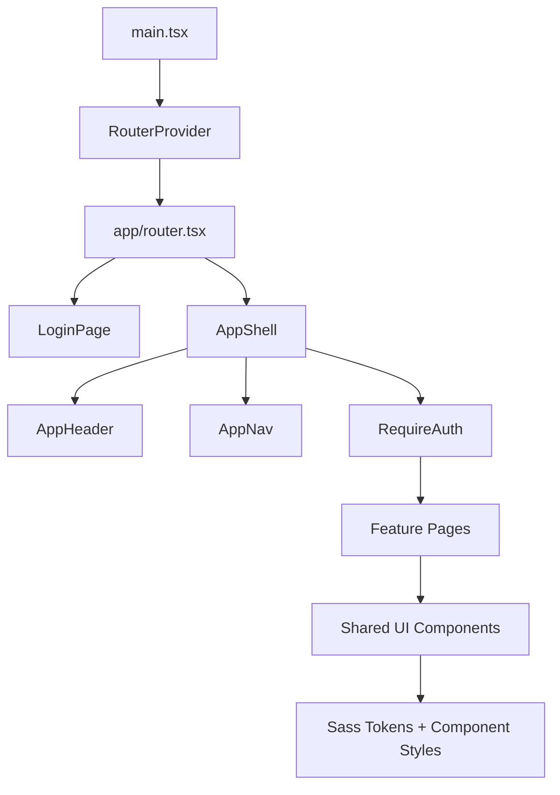
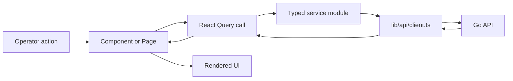

# Frontend Documentation Visual Proof

This document provides PR-ready proof that the frontend documentation system exists at file, code, and system levels.

## `/docs/frontend` structure

```text
docs/frontend/
├── README.md
├── architecture-overview.md
├── codebase-navigation.md
├── development-setup.md
├── documentation-template.md
├── production-setup.md
└── visual-proof.md
```

## Before and after source example

Before standardization, a representative file began directly with implementation code:

```ts
import { createBrowserRouter, Navigate } from "react-router-dom";
```

After standardization, the same class of file begins with a structured header:

```ts
/**
 * File: app/src/app/router.tsx
 *
 * Purpose:
 * Declares the browser route tree, authentication boundary, and page-to-path mapping for the frontend application.
 *
 * Responsibilities:
 * - Render accessible React UI for the owning workflow
 * - Coordinate props, hooks, and service data without leaking implementation details
 * - Expose predictable outputs for tests and consuming components
 */
```

## Rendered Mermaid source: component hierarchy



## Rendered Mermaid source: data flow



## Annotated critical logic examples

| File | Critical logic documented | Breakage explained |
| --- | --- | --- |
| `app/src/app/router.tsx` | Protected route branch under `RequireAuth` | Protected workflows would render before session validation. |
| `app/src/lib/api/client.ts` | Missing-token rejection and HTTP 401 session reset | Stale or absent tokens would keep UI state inconsistent with backend auth. |
| `app/src/features/properties/propertyTableState.ts` | Reconciliation of persisted table state with current columns | Removed columns could corrupt ordering, visibility, or width state. |
| `app/src/features/selectors/selectorSchema.ts` | Legacy selector normalization and field-role defaults | Saved templates could target different DOM nodes or update wrong property fields. |
| `app/src/hooks/useTheme.tsx` | System color-scheme listener and cleanup | Theme changes would not sync or listeners would leak. |

## Coverage summary

| Coverage area | Evidence |
| --- | --- |
| File-level headers | Every `*.ts`, `*.tsx`, and `*.scss` file under `app/src` has a structured header. |
| Component-level docs | Exported React components include top-level comments covering rendering, state, side effects, and performance. |
| Function-level docs | Exported non-trivial functions include comments covering parameters, returns, side effects, and edge cases. |
| Critical logic docs | Critical route, API, storage, normalization, and theme synchronization logic contains explicit annotations. |
| System docs | This `/docs/frontend` hierarchy documents architecture, setup, production, navigation, templates, and proof. |

## Related

- [Frontend Hub](./README.md)
- [Architecture Overview](./architecture-overview.md)
- [Development Setup](./development-setup.md)
- [Production Setup](./production-setup.md)
- [Codebase Navigation](./codebase-navigation.md)
