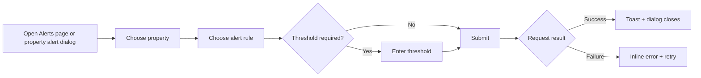
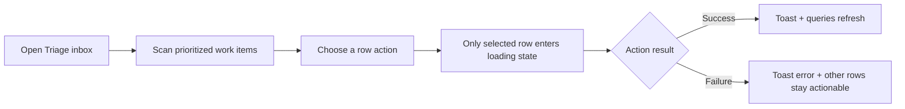
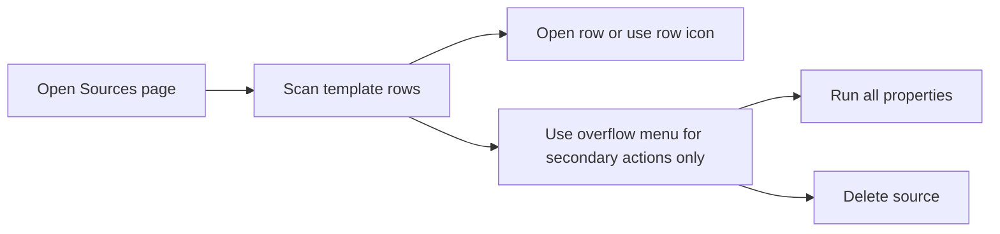

# UX Visual Proof Notes

## Local verification environment

- Frontend preview: `http://127.0.0.1:4173`
- Backend: `http://127.0.0.1:8080`
- Seed command used: `./cmd/nido.sh seed`
- Demo credentials: `admin@local` / `dev-password`

## Screenshot capture status

An automated screenshot pass was attempted after seeding local data and starting the backend/frontend preview servers. The app was reachable, but browser automation was blocked by the local Playwright lock:

> Browser is already in use for `/root/.cache/ms-playwright/mcp-chrome`, use `--isolated` to run multiple instances of the same browser

Because of that environment constraint, screenshot files could not be captured in this session.

## Workflow diagrams

### Alerts workflow

### Triage row-action workflow

### Source-list navigation workflow

