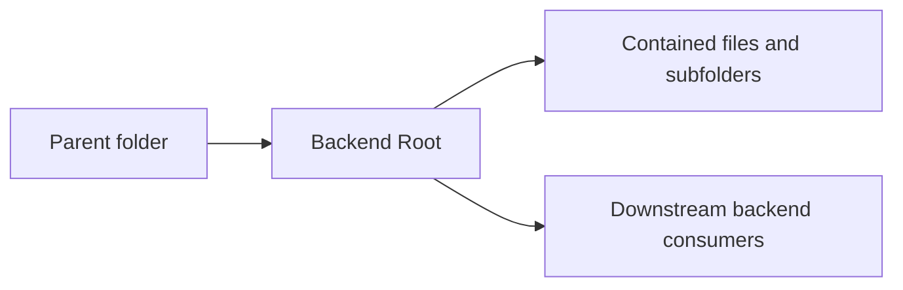

<!--
File Name: README.md
Purpose: Provides folder-level documentation for `.`.
Responsibilities:
- Explain this folder's role in the backend architecture.
- List contained components and downstream relationships.
- Capture constraints that contributors must preserve.
Inputs / Outputs: Markdown documentation consumed by backend contributors.
Dependencies: Parent and child folder documentation plus linked source files.
Side Effects: None.
Critical Notes: Keep this README synchronized with source changes in this folder.
-->

# Backend Root

## Purpose

Owns the Go backend module, executable entry points, internal packages, and backend documentation.

## Contained components

Root README, Go module files, command entry points, internal application packages, and docs.

### Files

- `.gitignore`
- `go.mod`
- `go.sum`

### Subfolders

- [`cmd/`](./cmd/README.md)
- [`docs/`](./docs/README.md)
- [`internal/`](./internal/README.md)

## Interactions with other folders

Frontend calls this process through `/api`; Docker/config files provide runtime settings.

## Notable patterns and constraints

- Keep package dependencies directed inward through interfaces where application services cross persistence or transport boundaries.
- Keep HTTP request/response shaping in `transport/httpapi` folders and business decisions in `application` folders.
- Keep domain models free of transport concerns unless explicit JSON contracts are part of persisted API behavior.
- Update file headers, symbol comments, and this README in the same change when behavior changes.

## Visual map

