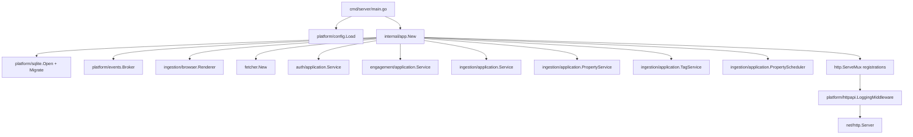
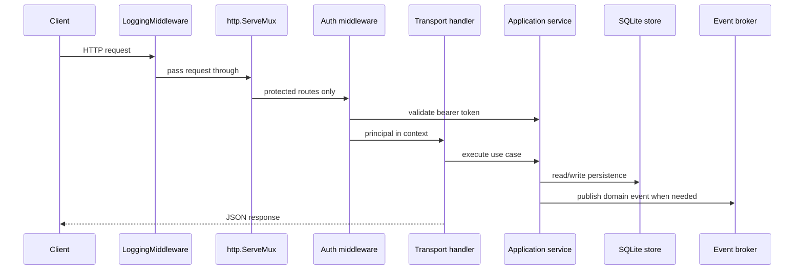
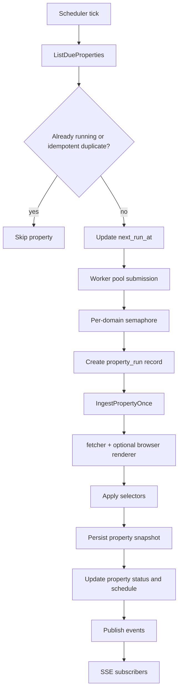

# Backend Architecture

## Purpose

The backend under `/server` is a Go modular monolith focused on authenticated property tracking and operational maintenance. The current mounted runtime centers on:

- bearer-authenticated user access
- property CRUD and extraction configuration
- snapshot ingestion and scheduler attempt tracking
- tags, bookmarks, alerts, and notifications
- source metadata management
- authenticated live event streaming over SSE

Several other packages still exist in the repository, but not every package is currently wired into the active runtime. This document describes the running system first and calls out dormant surfaces explicitly.

Use [local-development.md](./local-development.md) for startup and [maintenance.md](./maintenance.md) for change workflows.

## Process Overview

### Startup sequence

`internal/app/runtime.go` currently does the following in order:

1. open SQLite
2. run migrations
3. create the in-process event broker
4. create the optional browser renderer and shared fetcher
5. create the auth service and ensure the bootstrap admin exists
6. create engagement, source, property, and tag services
7. create and start the property scheduler
8. register health, auth, engagement, source, property, run, tag, and event routes
9. wrap the mux in logging middleware and hand it to `http.Server`

The composition root is intentionally compact. If you cannot explain a backend behavior from `cmd/server/main.go` plus `internal/app/runtime.go`, the design boundary is probably too blurry.

## Package Boundaries

| Package area | Responsibility | Current runtime status |
| --- | --- | --- |
| `cmd/server` | Process entrypoint, config loading, serve/migrate commands, graceful shutdown | Active |
| `internal/app` | Composition root and runtime lifecycle | Active |
| `internal/platform/config` | Environment parsing and defaulting | Active |
| `internal/platform/sqlite` | Schema, persistence, and repository implementation | Active |
| `internal/platform/httpapi` | JSON helpers, error helpers, SSE writer, request logging | Active |
| `internal/platform/events` | In-process pub/sub broker for live transport | Active |
| `internal/auth` | Bootstrap admin, sessions, auth middleware, current principal | Active |
| `internal/engagement` | Bookmarks, alert rules, notifications, notification publishing | Active |
| `internal/ingestion` | Source records, tracked properties, extraction config, previews, snapshots, tags, scheduler runs | Active |
| `internal/fetcher` | Shared HTTP fetch behavior, anti-bot mitigation, browser fallback orchestration | Active |
| `internal/ingestion/browser` | Optional server-side browser rendering | Active |
| `internal/engine` | Worker pool used by the property scheduler | Active |
| `internal/catalog` | Legacy catalog/listing handlers and service | Present in repo, not mounted |
| `internal/platform/objectstore` | Memory and S3-compatible object storage adapters | Present in repo, not composed by current runtime |

## Mounted HTTP Surface

The active runtime mounts these route groups:

- `GET /api/v1/health/live`
- `GET /api/v1/health/ready`
- `POST /api/v1/auth/login`
- `GET /api/v1/auth/me`
- `POST /api/v1/auth/logout`
- `PUT /api/v1/auth/me`
- `POST /api/v1/auth/me/password`
- `GET|POST|DELETE` bookmark, alert, notification routes under `/api/v1/me/*`
- `GET|POST|DELETE` source routes under `/api/v1/backoffice/sources*`
- `GET|POST|PUT|DELETE` property routes under `/api/v1/backoffice/properties*`
- `GET|POST|DELETE` tag routes under `/api/v1/backoffice/tags*`
- `GET|DELETE` global snapshot routes under `/api/v1/backoffice/runs*`
- `GET /api/v1/backoffice/events`

Not currently mounted:

- `/api/v1/listings*`
- source-level ingest routes

## Request Flow

### Transport rules

- Transport handlers stay thin. They decode JSON, validate obvious path/query issues, call a service, and write JSON.
- Auth is middleware-based. Downstream handlers read the current user/session from request context.
- `platform/httpapi.LoggingMiddleware` wraps `ResponseWriter` but preserves `Flush`, `Hijack`, `Push`, and `ReadFrom` so SSE keeps working.

## Property Ingestion Flow

### Important distinctions

- The scheduler creates `property_runs` records to track attempts, retries, and statuses.
- Manual and scheduled ingest both create property snapshots.
- The global `/api/v1/backoffice/runs` endpoints expose snapshots, not scheduler attempt rows.
- Property detail pages use `/api/v1/backoffice/properties/{propertyID}/runs` for scheduler history.

### Current scheduler behavior

- The property scheduler starts automatically in `app.New()`.
- `TickInterval` comes from configuration.
- Global concurrency is currently hardcoded to `4` in the composition root.
- Per-domain concurrency is currently hardcoded to `1` in the composition root.
- Retry count and backoff come from each tracked property.

## Event Model

The event broker is lightweight and in-process. Services publish event names plus arbitrary JSON-compatible payloads. The HTTP SSE endpoint subscribes one buffered channel per client and streams frames until the request ends.

Event families currently emitted include:

- auth-adjacent notification events via engagement
- source ingestion events such as `ingestion.fetch.completed`
- property events such as `property.created` and `property.run.completed`
- scheduler events such as `run.scheduled`, `run.started`, `run.completed`, and `run.failed`
- tag assignment events

Because the broker is in-process, events are best-effort and ephemeral. They are for operational visibility, not durable workflow orchestration.

## Configuration Reality Check

`internal/platform/config` defines a broader configuration surface than the current runtime consumes.

### Actively shaping the current runtime

- `HS_HTTP_ADDR`
- `HS_DATABASE_PATH`
- `HS_BOOTSTRAP_ADMIN_*`
- `HS_AUTH_SESSION_TTL`
- `HS_SCHEDULER_TICK_INTERVAL`
- `HS_SCHEDULER_SHUTDOWN_TIMEOUT`
- `HS_BROWSER_*`
- `HS_FETCHER_*`
- `HS_NOTIFICATION_WEBHOOK_URL`

### Parsed today but only partially or not visibly composed

- `HS_SCHEDULER_ENABLED`
- `HS_SCHEDULER_BATCH_SIZE`
- `HS_OBJECT_STORE_*`
- `HS_BOOTSTRAP_SOURCE_*`

That does not mean those settings are useless forever. It means the current `internal/app/runtime.go` does not yet wire the corresponding runtime behavior.

## Architectural Guardrails

- Keep `internal/app` as the only composition root.
- Keep transport handlers thin and use-case oriented.
- Keep storage implementation details behind interfaces owned by the application packages.
- Do not blur snapshots and property-run records. They represent different operational questions.
- Treat live events as observability, not as a hidden write path.

For day-2 workflows, testing strategy, and troubleshooting notes, continue in [maintenance.md](./maintenance.md).
