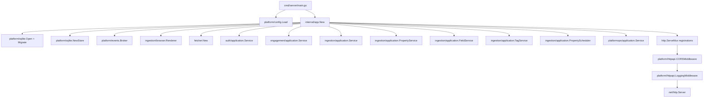
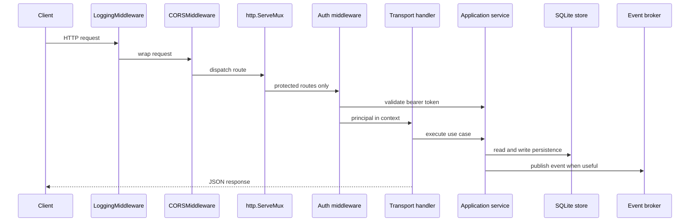
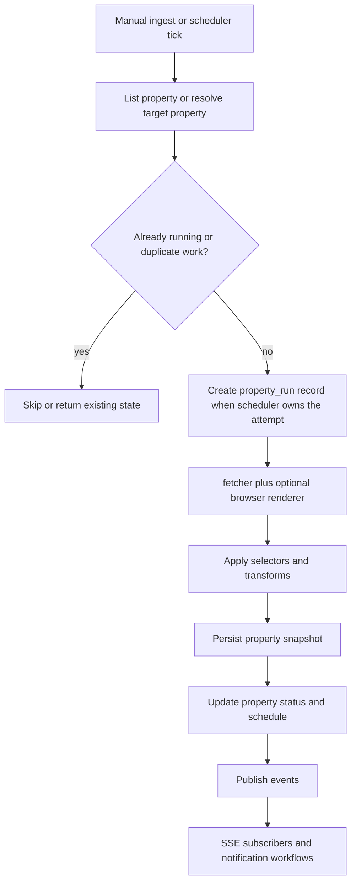

# Backend Architecture

## Purpose

The backend under `/server` is a Go modular monolith optimized for authenticated property tracking and operator workflows. Its fastest mental model is:

- one process
- one SQLite-backed runtime
- one explicit composition root
- thin HTTP transport
- application services owning orchestration
- best-effort live events for visibility, not correctness

Use [codebase-map.md](./codebase-map.md) when you need file locations, [design-patterns.md](./design-patterns.md) for stable implementation rules, [local-development.md](./local-development.md) to run the server, and [maintenance.md](./maintenance.md) for day-2 change workflows.

## Use This When

Read this when you need to answer any of these questions before editing code:

- what the active backend runtime actually mounts today
- where request, ingest, scheduler, and event behavior are decided
- which config is active versus parsed-only
- which boundaries must stay explicit during refactors

## System Model

The mounted runtime currently centers on:

- auth and current-user management
- engagement workflows such as bookmarks, alert rules, and notifications
- source and property tracking
- field definitions, analytics dataset export, and tag assignment
- property scheduling, retry-aware run history, and live SSE events
- platform settings, delivery logs, and notification test routes

The repository contains other backend packages, but directory presence alone is not a runtime guarantee. The active system is defined by `internal/app/runtime.go`.

## Runtime Composition

### Startup sequence

`internal/app/runtime.go` currently does the following in order:

1. open SQLite and run migrations
2. create the shared store and in-process event broker
3. create the optional browser renderer and shared fetcher
4. build the auth service and ensure the bootstrap admin exists
5. build engagement, source, property, field, tag, and platform-ops services
6. start the property scheduler and platform-ops background service
7. register health, auth, engagement, ingestion, property, field, tag, event, run, and platform routes
8. wrap the mux with CORS and logging middleware and hand it to `http.Server`

The composition root is intentionally compact. If you cannot explain a backend behavior from `cmd/server/main.go` plus `internal/app/runtime.go`, the boundary is probably too blurry.

## Mounted HTTP Surface

| Area | Route groups | Owning transport |
| --- | --- | --- |
| Health | `GET /api/v1/health/live`, `GET /api/v1/health/ready` | `internal/app/runtime.go` |
| Auth | `/api/v1/auth/login`, `/api/v1/auth/me`, `/api/v1/auth/logout`, `/api/v1/auth/me/password` | `internal/auth/transport/httpapi` |
| Engagement | `/api/v1/me/bookmarks*`, `/api/v1/me/alert-rules*`, `/api/v1/me/notifications*` | `internal/engagement/transport/httpapi` |
| Sources and live ops | `/api/v1/backoffice/sources*`, `/api/v1/backoffice/events`, `/api/v1/backoffice/runs*` | `internal/ingestion/transport/httpapi/handlers.go` |
| Properties | `/api/v1/backoffice/properties*` | `internal/ingestion/transport/httpapi/property_handlers.go` |
| Fields and analytics dataset | `/api/v1/backoffice/fields*`, `/api/v1/backoffice/analytics/dataset` | `internal/ingestion/transport/httpapi/field_handlers.go` |
| Tags | `/api/v1/backoffice/tags*`, `/api/v1/backoffice/properties/{propertyID}/tags*` | `internal/ingestion/transport/httpapi/tag_handlers.go` |
| Platform operations | `/api/v1/backoffice/platform/settings`, `/api/v1/backoffice/platform/summary`, `/api/v1/backoffice/platform/deliveries`, `/api/v1/backoffice/platform/test/{channel}` | `internal/platformops/transport/httpapi` |

Not currently mounted:

- `/api/v1/listings*`
- source-level ingest routes
- object-store-backed runtime endpoints

## Core Data Concepts

| Concept | Meaning | Common confusion to avoid |
| --- | --- | --- |
| Source | Upstream source metadata and reusable extraction template context | Not the same thing as a tracked property or a live ingest job |
| Property | A tracked URL with schedule and retry metadata | Created independently of snapshot results |
| Property config | Versioned extraction rules for a property | Preview can be stateless or property-scoped |
| Snapshot | Extracted property values persisted after ingest | The global `/api/v1/backoffice/runs` endpoints return these today |
| Property run | Scheduler attempt record with retry, timing, and status details | Exposed at `/api/v1/backoffice/properties/{propertyID}/runs`, not at the global runs endpoint |
| Field definition | Canonical field taxonomy and analytics normalization anchor | Separate from raw selector names scraped from HTML |
| Platform settings and delivery logs | Outbound channel configuration and operator-visible audit history | Separate from auth session configuration |

## Request Flow

Transport rules:

- Handlers decode JSON, validate obvious path and query issues, call a service, and write JSON.
- Auth stays middleware-based so downstream handlers read the current principal from context instead of re-validating tokens.
- `platform/httpapi.LoggingMiddleware` preserves `Flush`, `Hijack`, `Push`, and `ReadFrom` so SSE keeps working through middleware.

## Ingest And Scheduler Flow

Important distinctions:

- Manual and scheduled ingest both create property snapshots.
- The scheduler additionally creates `property_runs` records to track attempts, retries, and statuses.
- The property scheduler starts automatically in `app.New()`.
- `TickInterval` comes from config, while global concurrency `4` and per-domain concurrency `1` are currently hardcoded in the composition root.

## Design Patterns To Preserve

- `internal/app` is the only composition root.
- Mounted runtime wins over repo shape. If a package exists but `runtime.go` does not wire it, it is not a supported runtime surface.
- Transport stays thin. Business rules and orchestration belong in application services.
- Persistence stays behind the SQLite store. Do not push SQL details into handlers.
- Browser execution stays optional and explicit behind the fetcher and renderer boundary.
- Events are best-effort observability. Do not hide correctness-critical writes behind SSE delivery.
- Property snapshots and property runs answer different operational questions and must stay distinct.
- Concurrency and lifecycle defaults should stay visible in the composition root, not hidden in downstream packages.
- Config only matters when the runtime consumes it. Parsed-only settings are not product guarantees.

For the longer rationale, ownership table, and anti-patterns, continue in [design-patterns.md](./design-patterns.md).

## Configuration Reality Check

`internal/platform/config/config.go` defines a broader configuration surface than the current runtime consumes.

Actively shaping the mounted runtime today:

- HTTP listener and SQLite path
- bootstrap admin identity and auth session TTL
- scheduler tick, lock TTL, and shutdown timeout
- browser and fetcher settings
- notification and delivery settings

Parsed today but not fully wired end to end in `internal/app/runtime.go`:

- object-store settings
- bootstrap-source settings
- config-driven scheduler enable or disable behavior
- scheduler batch size

That does not make those settings useless forever. It means maintainers should not document them as active runtime guarantees until the composition root consumes them.

## Dormant And Future-Facing Surfaces

The backend repo still contains valid expansion paths that are not mounted today:

- public catalog and listing routes under `internal/catalog`
- object-store adapters under `internal/platform/objectstore`
- broader source-ingest orchestration beyond tracked-property workflows

Document these as dormant or future work, not as active behavior.

For package navigation, continue in [codebase-map.md](./codebase-map.md). For day-2 workflows, testing strategy, and troubleshooting notes, continue in [maintenance.md](./maintenance.md).
