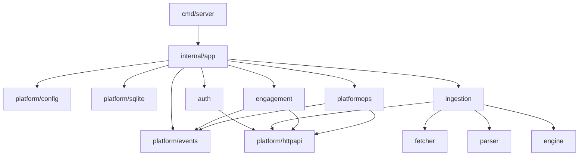

<!--
File Name: architecture.md
Purpose: Documents backend runtime architecture and component relationships.
Responsibilities:
- Explain runtime assembly order.
- Map component dependencies and downstream consumers.
- Highlight architecture constraints and risk areas.
Inputs / Outputs: Markdown architecture guide consumed by backend contributors.
Dependencies: internal/app/runtime.go and folder-level READMEs.
Side Effects: None.
Critical Notes: Keep route and lifecycle details aligned with runtime wiring.
-->

# Backend Architecture

## Runtime assembly order

[`internal/app/runtime.go`](../internal/app/runtime.go) builds the backend in one explicit path:

1. Load typed config before runtime construction.
2. Open SQLite through `internal/platform/sqlite`.
3. Apply migration policy and integrity checks.
4. Create shared platform infrastructure: event broker, fetcher, browser renderer, and stores.
5. Build auth, engagement, ingestion, field, tag, and platform operations services.
6. Start the property scheduler.
7. Register HTTP route groups on one `http.ServeMux`.
8. Wrap the mux with logging and CORS middleware.
9. Expose health endpoints and return a closeable runtime.

## Component relationships

## Mounted API surface

| Area | Mounted routes |
| --- | --- |
| Health | `/api/v1/health/live`, `/api/v1/health/ready` |
| Auth | `/api/v1/auth/*`, `/api/v1/auth/me*` |
| Engagement | `/api/v1/me/bookmarks*`, `/api/v1/me/alert-rules*`, `/api/v1/me/notifications*` |
| Sources | `/api/v1/backoffice/sources*` |
| Properties | `/api/v1/backoffice/properties*` |
| Runs | `/api/v1/backoffice/runs*` |
| Fields and analytics | `/api/v1/backoffice/fields*`, `/api/v1/backoffice/analytics/dataset` |
| Tags | `/api/v1/backoffice/tags*`, property tag routes |
| Platform operations | `/api/v1/backoffice/platform/*` |

## Architectural constraints

- HTTP handlers must stay thin and should not own business rules.
- Application services define store interfaces and own behavior orchestration.
- SQLite implementation details stay in `internal/platform/sqlite`.
- Domain packages should remain transport-independent except for stable JSON contract tags.
- Runtime wiring should remain explicit to avoid hidden dependency graphs.

## @critical runtime risk

Description: Runtime startup performs migration and scheduler initialization before serving traffic.

- Why critical: migration errors or scheduler misconfiguration can prevent readiness or create duplicate background work.
- What can break: startup, data safety, property refresh cadence, and operational summaries.
- Failure conditions: failed backup creation, invalid migration strategy, unwritable database path, or duplicate backend writer processes.
