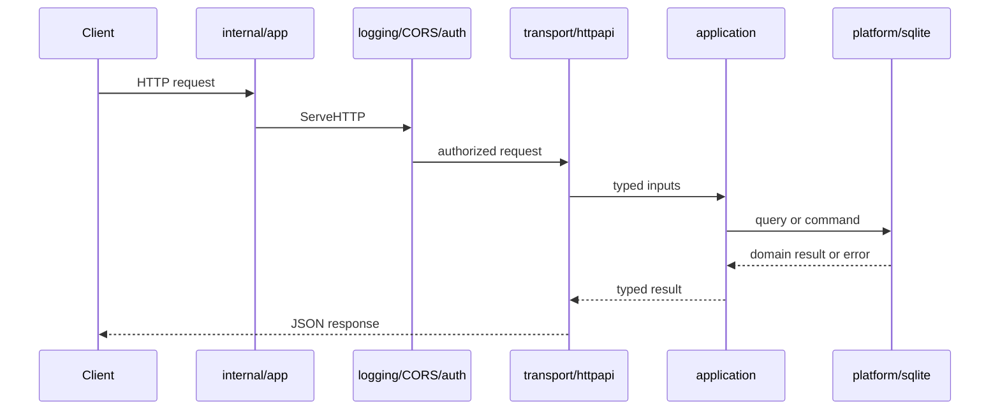
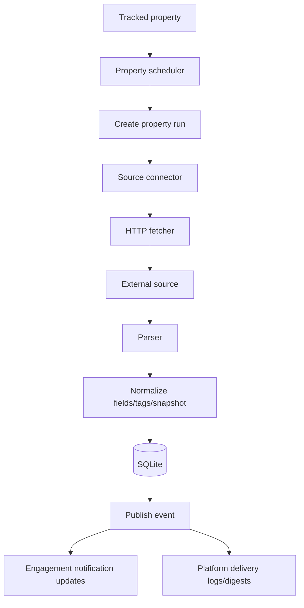
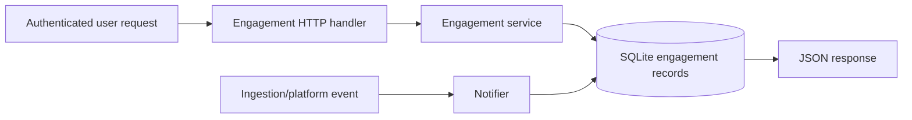
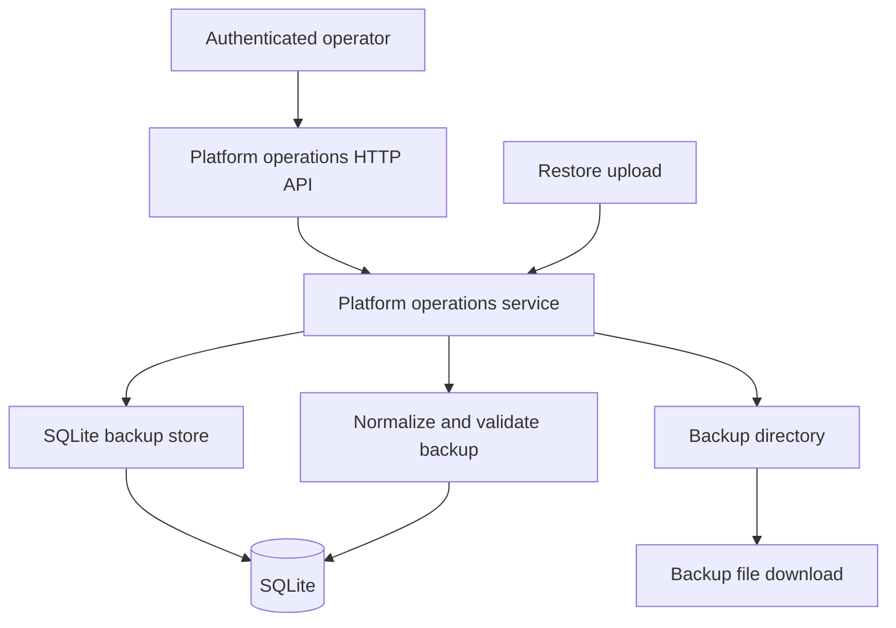

<!--
File Name: data-flow.md
Purpose: Documents backend data flows and workflow diagrams.
Responsibilities:
- Show request, ingestion, engagement, and operational workflows.
- Provide Mermaid diagrams for major backend processes.
- Link workflows back to source folders.
Inputs / Outputs: Markdown workflow guide consumed by engineers and reviewers.
Dependencies: Runtime, transport, application, SQLite, ingestion, engagement, and platformops packages.
Side Effects: None.
Critical Notes: Update diagrams when route flow or persistence flow changes.
-->

# Backend Data Flow

## Request flow

## Ingestion flow

## Engagement flow

## Backup / restore flow

## Data contract table

| Contract | Producer | Consumer | Persistence |
| --- | --- | --- | --- |
| `authdomain.User` / `Session` | Auth service and SQLite store | Auth transport and middleware | SQLite users/sessions tables |
| `ingestiondomain.Property` | Ingestion service/store | Property handlers, scheduler, engagement | SQLite properties tables |
| `ingestiondomain.PropertySnapshot` | Parser + ingestion service | Analytics and property details | SQLite snapshots/field values |
| `engagementdomain.Notification` | Engagement notifier/service | Notifications API | SQLite notification records |
| `platformopsdomain.WorkspaceBackup` | Platform operations service/store | Backup download/restore API | JSON backup payload plus SQLite import/export |

Events improve observability and notifications, but durable correctness comes from SQLite state.
