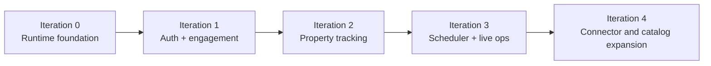

# Iteration Roadmap

## Status Note

This roadmap is now aligned to the currently mounted backend runtime. Some repo-level capabilities still exist in code or config without being fully wired into `internal/app/runtime.go`; those are called out as future or dormant work instead of being presented as active product surface.

## Iteration 0: Runtime Foundation

Status: implemented

- Create the Go module and process entrypoint.
- Add the composition root and runnable HTTP server.
- Add SQLite bootstrap and migrations.
- Add the HTTP transport helpers, logging middleware, and health endpoints.
- Establish documentation and local development flows.

## Iteration 1: Authentication And User Engagement

Status: implemented

- Bootstrap admin provisioning
- Bearer-session login, session validation, logout, profile update, and password change
- Bookmarks, alert rules, and notifications
- Notification event publication

The current runtime mounts this surface end to end.

## Iteration 2: Property Tracking And Extraction

Status: implemented

- Source CRUD for reusable source metadata
- Tracked property CRUD
- Extraction config versioning
- Stateless preview and property-scoped preview
- Manual ingest for tracked properties
- Snapshot persistence and retrieval
- Property tagging and tag assignment APIs

This is the current operational center of the backend.

## Iteration 3: Scheduler And Live Operations

Status: implemented and under hardening

- Property scheduler with global worker pool and per-domain concurrency limits
- Retry-aware property-run records
- Live SSE event stream through the in-process broker
- Request logging that preserves streaming behavior
- Fetcher/browser integration for anti-bot-aware property retrieval

This is the iteration that makes the backend behave like an operations system rather than a request-only CRUD service.

## Iteration 4: Dormant Or Future Expansion

Present in repo or config, but not fully wired in the current runtime

- Public catalog/listings routes
- Object-store-backed artifact persistence in the active runtime
- Bootstrap source auto-registration from config
- Config-driven scheduler enable/disable behavior
- Broader source-ingestion orchestration beyond tracked-property workflows

These are valid future directions, but they should not be documented or discussed as active runtime guarantees until `internal/app/runtime.go` composes them.
