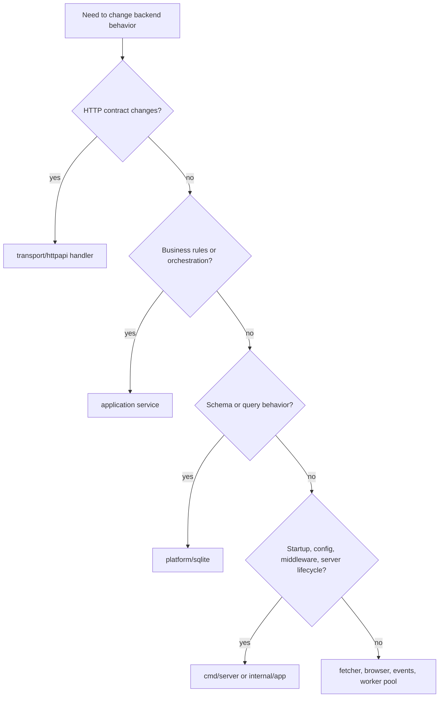

# Backend Maintenance Guide

## Read Order

When you are new to the backend, read these first:

1. [architecture.md](./architecture.md)
2. [local-development.md](./local-development.md)

Then start from `cmd/server/main.go` and `internal/app/runtime.go` before exploring deeper packages.

## Daily Commands

From the repository root:

```bash
GOTOOLCHAIN=local ./third-party/go/bin/go -C server run ./cmd/server
GOTOOLCHAIN=local ./third-party/go/bin/go -C server run ./cmd/server migrate
GOTOOLCHAIN=local ./third-party/go/bin/go -C server test ./...
./cmd/sqlite.sh tables
```

When narrowing a change, prefer running tests against the touched package first and `./...` second.

## Find The Owning Layer First



Avoid starting in the transport layer when the behavior is decided lower down. Handlers should remain thin.

## Common Change Workflows

### Add Or Change An Endpoint

1. Extend the relevant application service interface and implementation.
2. Add or update store methods if persistence changes.
3. Update the transport handler.
4. Add or update focused tests near the touched package.
5. Update `app/src/services/...` and the frontend contract doc if the UI consumes the route.

### Add A Property Tracking Capability

Property work usually spans these layers together:

- `internal/ingestion/application/property_service.go`
- `internal/ingestion/transport/httpapi/property_handlers.go`
- `internal/platform/sqlite/store.go`
- frontend service/types under `app/src/services/properties`

Keep the distinction between these two concepts explicit:

- property snapshots: stored extraction results
- property runs: scheduler attempts with retry metadata

### Add Or Change Event Publishing

1. Publish from the application service that owns the state change.
2. Keep payloads JSON-friendly and small.
3. Do not rely on SSE delivery for correctness.
4. If the frontend needs special handling, update `app/src/services/backoffice-events` and document the new event.

### Change Scheduler Behavior

Before editing the scheduler, verify whether the change belongs in:

- property scheduling and retries: `property_scheduler.go`
- single ingest execution: `property_service.go`
- worker-pool behavior: `internal/engine`
- runtime composition defaults: `internal/app/runtime.go`

Keep concurrency decisions visible in the composition root. Hidden scheduler magic is hard to reason about operationally.

## Debugging Checklist

### SSE endpoint fails or never streams

- Check authentication first.
- Check that the response writer still implements `http.Flusher` through middleware.
- Check whether the event broker is receiving publishes from the expected service.

### Property never runs automatically

- Check the property's `next_run_at`, `last_run_at`, status, and schedule interval.
- Check the scheduler tick interval.
- Remember that the current runtime starts the property scheduler automatically.
- Remember that `HS_SCHEDULER_ENABLED` is parsed but not currently used to disable the scheduler.

### Run history looks inconsistent

- Global `/backoffice/runs` is snapshot history.
- `/backoffice/properties/{id}/runs` is scheduler attempt history.
- Make sure the UI or API caller is looking at the correct surface.

### 403 or anti-bot fetch failures

- Check the shared fetcher configuration.
- If browser rendering is needed, check `HS_BROWSER_COMMAND` and arguments.
- Do not assume every fetch should escalate to browser execution. Keep that choice explicit.

### Config changes appear to do nothing

- Confirm the config field is actually consumed in `internal/app/runtime.go`.
- Several settings are defined in `platform/config` before they are wired into the active runtime.

## Testing Strategy

- Package-local tests should prove behavior where it is decided.
- `internal/app/runtime_test.go` is the best place to verify mounted routes and cross-module composition.
- `internal/ingestion/application/*_test.go` should carry most scheduler and property behavior coverage.
- SQLite behavior should be tested through the store, not reimplemented in mocks.

When fixing a bug, prefer one focused failing test in the owning package over a broad integration test that hides the decision point.

## Documentation Discipline

- Update runtime docs when mounted routes change.
- Update the frontend contract doc when wire shapes change.
- Call out dormant packages or config in docs instead of letting new contributors infer behavior that does not exist yet.

The fastest way to create maintenance debt in this codebase is to let repository shape and runtime shape drift silently.