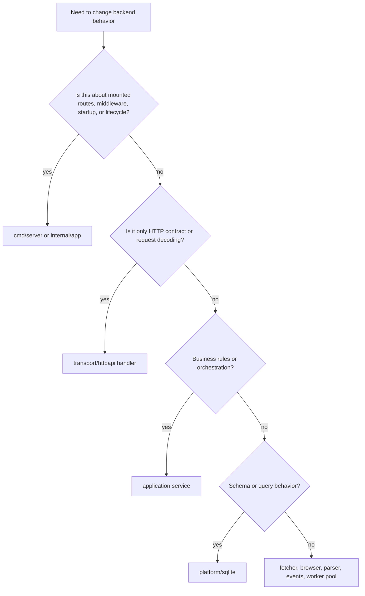

# Backend Maintenance Guide

## Purpose

This guide is for day-2 backend work: changing behavior, debugging regressions, validating fixes, and keeping the docs aligned with the mounted runtime.

Use [architecture.md](./architecture.md) for runtime boundaries, [design-patterns.md](./design-patterns.md) for stable implementation rules, and [local-development.md](./local-development.md) to run and verify the backend.

## Read These First

When you are new to the backend, read these first:

1. [codebase-map.md](./codebase-map.md)
2. [architecture.md](./architecture.md)
3. [design-patterns.md](./design-patterns.md)
4. [local-development.md](./local-development.md)

Then start from `cmd/server/main.go`, `internal/app/runtime.go`, and `internal/app/runtime_test.go` before you fan out into deeper packages.

## Find The Owning Layer First



Avoid starting in the transport layer when the behavior is decided lower down. Handlers should stay thin.

## Change Routing Matrix

| If you are changing... | Start in... | Usually also touch... | Focused validation |
| --- | --- | --- | --- |
| Mounted routes, middleware, lifecycle, health endpoints | `internal/app/runtime.go` or `cmd/server/main.go` | `internal/app/runtime_test.go`, server docs | `go test ./internal/app` |
| Auth or current-user behavior | `internal/auth/application/service.go` | `internal/auth/transport/httpapi/handlers.go` | relevant auth or runtime tests |
| Engagement flows | `internal/engagement/application/service.go` | `internal/engagement/transport/httpapi/handlers.go` | `go test ./internal/engagement/application` |
| Source CRUD, global runs, or SSE | `internal/ingestion/application/service.go` | `internal/ingestion/transport/httpapi/handlers.go` | `go test ./internal/ingestion/application` |
| Property preview, ingest, config versioning, snapshots | `internal/ingestion/application/property_service.go` | `internal/ingestion/transport/httpapi/property_handlers.go`, `internal/platform/sqlite/store.go` | `go test ./internal/ingestion/application` |
| Scheduler behavior | `internal/ingestion/application/property_scheduler.go` | `internal/app/runtime.go`, `internal/engine` | `go test ./internal/ingestion/application` |
| Fields or analytics dataset behavior | `internal/ingestion/application/field_service.go` | `internal/ingestion/transport/httpapi/field_handlers.go`, `internal/platform/sqlite/field_store.go` | `go test ./internal/ingestion/application` |
| Tags | `internal/ingestion/application/tag_service.go` | `internal/ingestion/transport/httpapi/tag_handlers.go` | `go test ./internal/ingestion/application` |
| Platform settings, delivery logs, test-channel behavior | `internal/platformops/application/service.go` | `internal/platformops/transport/httpapi/handlers.go` | route or runtime tests |
| Schema or repository behavior | `internal/platform/sqlite` | owning application service and tests | package-local Go tests |
| Env or config handling | `internal/platform/config/config.go` | `internal/app/runtime.go`, docs | `go test ./internal/platform/config` |
| Anti-bot or extraction behavior | `internal/fetcher`, `internal/parser`, or `internal/ingestion/connectors` | owning application service | matching package tests |

## Common Workflows

### Add Or Change An Endpoint

1. Extend the relevant application service interface and implementation.
2. Add or update store methods if persistence changes.
3. Update the transport handler.
4. If the endpoint is new, wire it through `internal/app/runtime.go` or the route registrar it already mounts.
5. Add or update focused tests near the touched package.
6. Update the server docs and any frontend service or contract docs if the UI consumes the route.

### Change Property Tracking Behavior

Property work usually spans these layers together:

- `internal/ingestion/application/property_service.go`
- `internal/ingestion/application/property_scheduler.go`
- `internal/ingestion/transport/httpapi/property_handlers.go`
- `internal/platform/sqlite/store.go`

Keep this distinction explicit:

- property snapshots are stored extraction results
- property runs are scheduler attempts with retry metadata

### Change Scheduler Behavior

Before editing the scheduler, decide whether the change belongs in:

- property scheduling and retries: `property_scheduler.go`
- single ingest execution: `property_service.go`
- worker-pool behavior: `internal/engine`
- runtime defaults and lifecycle: `internal/app/runtime.go`

Keep concurrency decisions visible in the composition root. Hidden scheduler magic is hard to reason about operationally.

### Change Config Or Environment Handling

1. Add or update parsing in `internal/platform/config/config.go`.
2. Wire the new setting into `internal/app/runtime.go` or the owning service.
3. Add or update `internal/platform/config/config_test.go`.
4. Update [local-development.md](./local-development.md) and [architecture.md](./architecture.md) so maintainers can tell whether the setting is active or parsed only.

### Change Event Publishing Or Notifications

1. Publish from the application service that owns the state change.
2. Keep payloads small and JSON-friendly.
3. Do not rely on SSE delivery for correctness.
4. If operator-visible behavior changes, update platform-ops docs and any frontend event consumers.

## Debugging Checklist

### Route returns 404 or behavior seems missing

- Confirm the route is mounted in `internal/app/runtime.go`.
- Check the relevant transport registrar under `internal/*/transport/httpapi`.
- If the route should be mounted, add or update `internal/app/runtime_test.go` so future drift is visible.

### Backoffice route returns 401 or 403

- Check bearer auth first.
- Confirm the route is wrapped with the auth middleware.
- Verify login and session behavior through the auth service instead of duplicating token parsing in handlers.

### SSE endpoint fails or never streams

- Check authentication first.
- Check that the response writer still implements `http.Flusher` through middleware.
- Check whether the event broker is receiving publishes from the expected service.

### Property never runs automatically

- Check the property's `next_run_at`, `last_run_at`, status, and schedule interval.
- Check the scheduler tick interval.
- Remember that the current runtime starts the property scheduler automatically.
- Remember that `NIDO_SCHEDULER_ENABLED` is parsed but not currently used to disable the scheduler.

### Run history looks inconsistent

- Global `/backoffice/runs` is snapshot history.
- `/backoffice/properties/{id}/runs` is scheduler attempt history.
- Make sure the caller is looking at the correct surface.

### 403 or anti-bot fetch failures

- Check the shared fetcher configuration first.
- If browser rendering is needed, check `NIDO_BROWSER_COMMAND`, `NIDO_BROWSER_ARGS`, and `NIDO_BROWSER_TIMEOUT`.
- Do not assume every fetch should escalate to browser execution. Keep that choice explicit.
- Headless browser fallback reduces some failures, but it does not guarantee bypass of all anti-bot systems.

### Config changes appear to do nothing

- Confirm the setting is parsed in `internal/platform/config/config.go`.
- Confirm the parsed field is consumed in `internal/app/runtime.go` or the owning service.
- Several settings are defined before they are wired into the active runtime.

### Platform delivery tests fail

- Check platform settings persistence and normalized webhook URLs.
- Check notification configuration and delivery logs under the platform-ops service.
- Confirm the route you are using is one of the mounted `/api/v1/backoffice/platform/*` endpoints.

## Validation Defaults

Package-local tests should prove behavior where it is decided. Start narrow, then broaden:

```bash
GOTOOLCHAIN=local ./third-party/go/bin/go -C server test ./internal/app
GOTOOLCHAIN=local ./third-party/go/bin/go -C server test ./internal/ingestion/application
GOTOOLCHAIN=local ./third-party/go/bin/go -C server test ./internal/engagement/application
GOTOOLCHAIN=local ./third-party/go/bin/go -C server test ./internal/platform/config
GOTOOLCHAIN=local ./third-party/go/bin/go -C server test ./...
```

Testing rules:

- `internal/app/runtime_test.go` is the best place to verify mounted routes and cross-module composition.
- `internal/ingestion/application/*_test.go` should carry most scheduler, property, field, and tag behavior coverage.
- SQLite behavior should be tested through the store, not reimplemented in mocks.
- Prefer one focused failing test in the owning package over a broad integration test that hides the decision point.

## Documentation Discipline

Update docs in the same change when you modify any of these boundaries:

- mounted routes or middleware
- config consumption in `internal/app/runtime.go`
- scheduler lifecycle, concurrency defaults, or property-run semantics
- active versus dormant package boundaries

Also update adjacent docs when needed:

- frontend contract docs when wire shapes change
- frontend service clients when route or payload contracts change
- runtime tests when mounted surfaces change

The fastest way to create maintenance debt in this codebase is to let repository shape and runtime shape drift silently.